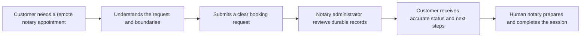
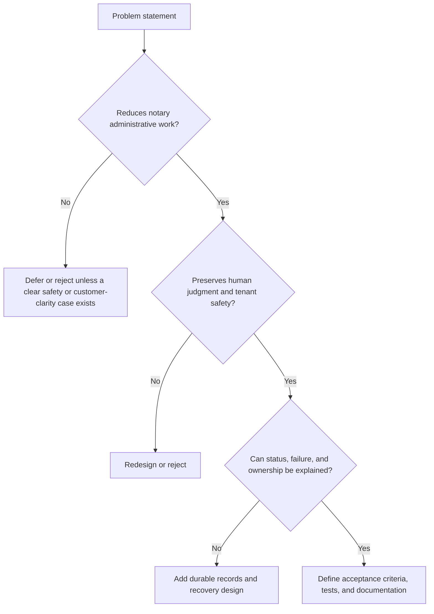

# North Star

**Status:** Current decision framework for product and engineering work.

## Product philosophy

The North Star is simple: **reduce administrative work for the notary while increasing customer clarity and preserving professional control.**

Avenseal is not optimized for activity, feature count, or decorative dashboards. It is optimized for a trustworthy operational path: accurate records, fewer manual handoffs, clear customer communication, and timely human review.

## Ideal customer journey

## What every feature should optimize for

| Priority | Test |
| --- | --- |
| Administrative leverage | Does it eliminate, shorten, or make a recurring notary task safer? |
| Customer clarity | Does it reduce uncertainty about status, next step, or responsibility? |
| Professional control | Does it keep consequential notarial and legal judgment with a person? |
| Operational truth | Does it create a durable, reviewable record rather than an opaque action? |
| Safe simplicity | Is it the smallest coherent solution with known failure behavior? |

## Feature evaluation process

Accept work only when it has a demonstrated user or operator problem, a **Current**, **Planned**, or **Future Vision** classification, a clear owner, and proportionate validation. Defer work that duplicates a provider dashboard, hides authorization behind UI, creates unsupported automation claims, or cannot explain failure and tenant impact.

## Decision record

| Decision | Required evidence |
| --- | --- |
| Build now | Clear administrative/customer impact, narrow scope, safe architecture, measurable acceptance criteria |
| Plan next | Validated problem with unresolved dependency, policy, or operational ownership |
| Future Vision | Strategic direction without a committed scope or delivery date |
| Reject | No reduction in administrative work, weak customer value, unsafe automation, or duplicative complexity |

Use this framework with [Vision](vision.md), then classify and sequence work in the [Roadmap](roadmap.md). Delivery standards are in the [Codex Playbook](../04-development/codex-playbook.md).
