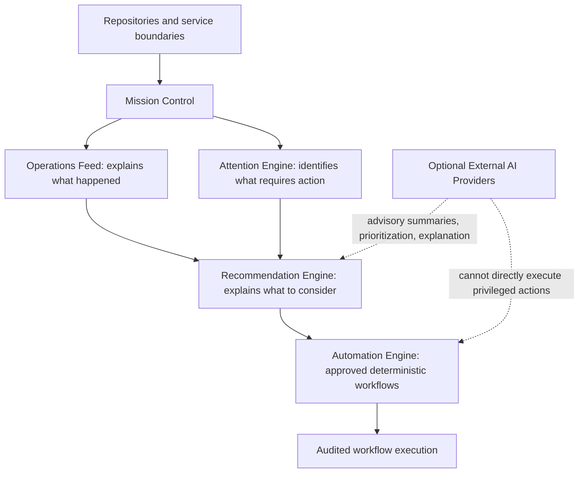

# Product Roadmap

**Status language:** **Current** = implemented and evidenced in the repository; **Planned** = intended but not shipped; **Future Vision** = directional only; **Technical Debt** = known risk or operational gap.

Priority reflects sequencing, not a delivery promise. This roadmap is the Product Blueprint’s canonical product sequence. Detailed historical status remains in the [product roadmap](../product/roadmap.md) and [milestones](../product/milestones.md).

## Current platform context

| Initiative | Classification | Customer impact |
| --- | --- | --- |
| Public booking, admin operations, organization configuration, and secure status access | Current | Customers can request appointments; operators can review durable records |
| Availability, service snapshots, Stripe/Google foundations, communications queue, and reminders | Current foundation | Scheduling, payment, integration, and communication boundaries are durable and explicit |
| Communications Center | Current foundation | Operators can inspect scheduled, queued, sent, and failed communications |

## Roadmap sequence

1. Product Blueprint and Design System — **Current**
2. Mission Control Foundation — **Current**
3. Live Mission Control Data — **Current**
4. Operations Feed — **Current**
5. Attention Engine — **Current**
6. AI Recommendations Foundation and deterministic AI Provider abstraction — **Current**
7. Automation Engine — **Planned next**
8. Customer Timeline — **Planned**
9. Email Designer — **Planned**
10. Analytics and Reporting — **Planned**
11. External AI Providers — **Planned**
12. Advanced Autonomous Operations — **Future Vision**

Automation precedes Customer Timeline, Email Designer, Analytics and Reporting, and external AI Providers because Avenseal first needs a trustworthy, deterministic way to execute repetitive operational work. That establishes auditable outcomes, idempotency, tenant boundaries, and human controls before expanding customer-facing tooling, reporting, or advisory AI capabilities.

## Phase 1 — Product and Platform Foundation

| Initiative | Classification | Outcome |
| --- | --- | --- |
| Product Blueprint | Current | Version-controlled product, design, architecture, and engineering source of truth |
| Design System | Current | Shared tokens, component standards, accessibility, and content guidance |
| Mission Control Foundation | Current | Focused operational homepage and reusable Mission Control sections |
| Live Mission Control Data | Current | Server-side, tenant-scoped operational data with honest partial and unknown states |

## Phase 2 — Operational Intelligence

| Initiative | Classification | Outcome |
| --- | --- | --- |
| Operations Feed | Current | Read-only chronological evidence of supported operational activity |
| Attention Engine | Current | Deterministic identification of actionable operational issues |
| AI Recommendations Foundation | Current | Explainable, evidence-backed deterministic recommendations |
| AI Provider abstraction with deterministic provider | Current | Provider-neutral recommendation boundary without an external AI dependency |

## Phase 3 — Workflow Automation

| Initiative | Classification | Dependencies | Intended outcome |
| --- | --- | --- | --- |
| [Automation Engine](../03-product/automation-engine.md) | Planned next | Trusted repository and service boundaries, deterministic rules, audit model | A deterministic, auditable workflow-execution layer that preserves human control |
| Automation history and auditability | Planned | Automation Engine | Durable explanation of each attempted workflow and outcome |
| Human controls | Planned | Automation Engine | Pause, disable, and manual-review controls for consequential workflows |
| Safe retry and idempotency | Planned | Automation Engine, provider/service boundaries | Retry eligible work without duplicate actions |

Automation Engine candidates are roadmap candidates—not current features. They may include retrying eligible failed communications, scheduling supported follow-up reminders, queueing review requests after qualifying completed appointments, running explicit appointment or communication workflows, recording outcomes and failures, and providing pause, disable, and manual-review controls.

The Automation Engine must:

- execute only explicit deterministic rules;
- use existing repository and service boundaries rather than UI-owned workflow logic;
- be auditable and record execution outcomes and failures;
- be idempotent where actions can be retried and prevent duplicate actions;
- preserve organization and tenant isolation;
- fail safely and support human oversight; and
- never allow AI-generated text alone to trigger an action.

## Phase 4 — Customer and Communication Experience

| Initiative | Classification | Dependencies | Intended outcome |
| --- | --- | --- | --- |
| Customer Timeline | Planned | Durable appointment, payment, calendar, communication, and automation events | One chronological explanation of an appointment lifecycle |
| Email Designer | Planned | Approved template model, versioning, audit, preview, and automation boundaries | Administrators can manage approved customer copy safely |
| Customer Portal improvements | Planned | Secure access links, appointment-change policies, communications | Eligible self-service without weakening operational control |

## Phase 5 — Business Intelligence

| Initiative | Classification | Dependencies | Intended outcome |
| --- | --- | --- | --- |
| Analytics and Reporting | Planned | Durable event definitions, automation outcomes, retention policy, measurement ownership | Operational reporting based on verified records rather than inferred trends |

## Phase 6 — External Intelligence and Autonomous Operations

| Initiative | Classification | Dependencies | Intended outcome |
| --- | --- | --- | --- |
| External AI Providers | Planned | Structured recommendation context, provider review, tenant/privacy controls, deterministic workflow controls | Optional advisory summaries, prioritization, and explanation of structured information |
| Advanced Autonomous Operations | Future Vision | Explicit policy, auditability, human controls, tenant isolation, and safe failure evidence | Directional opportunity; not an approved autonomous-action commitment |
| Voice Receptionist and Document Intelligence | Future Vision | Consent, privacy review, verified identity, escalation policy, and human review | Guided intake or review support without automated legal or notarial judgment |

External AI Providers remain an advisory layer. They may summarize, prioritize, or explain structured information, but cannot bypass deterministic workflow controls or directly execute privileged actions.

## Architectural relationship

## Product principles carried through the roadmap

- Automation before repetitive manual work.
- Human control over consequential actions.
- Explainability and auditability.
- Data integrity and tenant isolation.
- Safe failure behavior.
- AI as an advisory capability before autonomous execution.

## Technical debt

Monitoring and alerting, calendar recovery scheduling, delivery reconciliation, production scheduler ownership, retention/deletion procedures, and incident runbooks remain documented in the [technical debt backlog](../technical-debt/backlog.md). These gaps must not be recast as Automation Engine capabilities until their evidence and ownership are explicit.

Every roadmap item must pass the [North Star](north-star.md) test: does it reduce administrative work for the notary while improving customer clarity and professional control?
