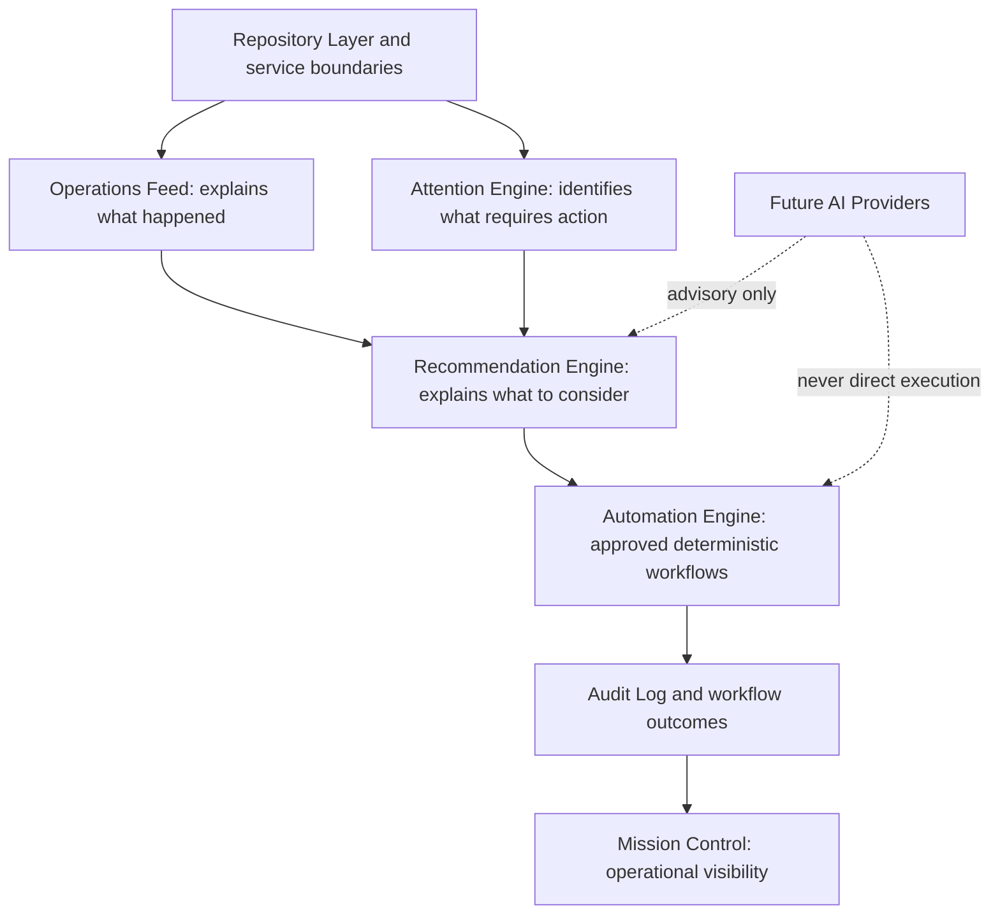

# Automation Engine PRD

**Status:** Planned. This document defines the intended product behavior and safety boundaries for deterministic automation. It does not describe an implemented feature, API, database design, or scripting environment.

**Related:** [Roadmap](../00-overview/roadmap.md) · [Mission Control PRD](mission-control.md) · [Automation Rule Catalog](automation-rules.md) · [Automation Lifecycle](automation-lifecycle.md) · [Automation Engineering Contract](../04-development/automation-contract.md) · [Design Principles](../01-design-system/design-principles.md) · [Codex Playbook](../04-development/codex-playbook.md)

## Executive summary

The Automation Engine is Avenseal’s planned deterministic workflow-execution layer. It executes approved product-owned rules against trusted operational records while preserving human control, tenant isolation, auditability, and safe failure behavior.

It is not an AI workflow engine, a scripting language, a visual workflow builder, or a Zapier-like integration surface. It does not infer new policy. It performs only explicit workflows the product has defined, reviewed, and made observable.

## Problem statement

Operators currently coordinate repeatable work across appointments, communications, reminders, and integrations. Requiring manual handling for every recoverable or routine workflow creates delay and inconsistency. Automating without durable rules, idempotency, or oversight would introduce duplicate messages, cross-tenant risk, and hidden consequential actions.

The product needs a controlled way to execute approved operational workflows without turning Mission Control into a workflow runtime or allowing advisory AI to act on its own.

## Goals

- Execute explicit, deterministic, product-owned workflows.
- Preserve human approval for consequential actions and clear manual-review routes.
- Record every decision, attempted action, outcome, failure, retry, pause, cancellation, and override in an audit trail.
- Prevent duplicate actions through idempotency and rule-specific cooldowns.
- Preserve organization and tenant boundaries for every input, action, and audit record.
- Fail safely: do not silently continue after an ambiguous or unsafe condition.
- Surface operational outcomes through the existing Mission Control evidence model.

## Non-goals

- LLM-generated workflows, prompts, embeddings, or natural-language automation creation.
- Autonomous AI execution or AI-generated text as an action trigger.
- User-created workflows, conditional scripting, visual workflow building, or marketplace automations.
- New third-party integrations solely for automation.
- Replacing repository or service boundaries with UI-owned workflow logic.

## Product principles

1. **Deterministic:** the same eligible inputs and rule version produce the same intended decision.
2. **Auditable:** every execution has durable, safe-to-review evidence.
3. **Explainable:** operators can identify the rule, trigger, conditions, and outcome behind an action.
4. **Idempotent:** retryable actions do not produce duplicates.
5. **Tenant-isolated:** no rule, action, or audit record crosses organization boundaries.
6. **Safe failure:** ambiguity, missing evidence, unavailable dependencies, and exceeded limits stop execution safely.
7. **Human control:** consequential actions require the documented approval or manual-review model.
8. **No hidden automation:** affected operators can discover the rule and its outcome.
9. **AI is advisory:** AI may recommend or explain; it never directly executes privileged actions.
10. **Reversible when practical:** workflows define rollback or compensating behavior where a safe reversal exists.

## Architecture and product relationship

The Automation Engine receives approved, structured workflow inputs through existing product boundaries. It does not replace the Repository Layer or execute browser-originated business logic.

| Product surface | Intended relationship |
| --- | --- |
| Mission Control | Shows evidence, attention, recommendations, and auditable outcomes; it is not the execution runtime. |
| Operations Feed | Explains what happened before and after supported workflow execution. |
| Attention Engine | Identifies durable conditions that may make a rule eligible; it does not execute a rule. |
| Recommendation Engine | Explains a supported action an operator should consider; it does not grant execution authority. |
| Repository Layer | Remains the trusted persistence and workflow boundary used by automation. |
| Future AI Providers | May summarize, prioritize, or explain structured information; they cannot bypass deterministic controls. |

## Execution model

Each approved rule has a documented trigger, preconditions, action, ownership, idempotency strategy, timeout, retry policy, and failure route. A workflow becomes eligible only when its trigger and every precondition are supported by trusted records.

Before an action, the engine verifies the organization boundary, rule status, pause/disable state, cooldown, prior execution identity, and required approvals. It then runs the explicit action through the applicable repository or service boundary, records the outcome, and exposes a safe operational summary.

The complete state model is defined in the [Automation Lifecycle](automation-lifecycle.md). Rule-specific behavior belongs in the [Automation Rule Catalog](automation-rules.md).

## Human approval model

Automation may perform only actions explicitly designated as eligible for deterministic execution. Rules with financial, externally visible, irreversible, privacy-sensitive, or policy-ambiguous consequences require documented human approval or manual review before execution.

Operators must be able to pause a rule, disable automation at the organization level, cancel pending work where safe, and review failures. Manual retry is an explicit operator action governed by the same idempotency and authorization controls as automated retry.

## Auditability and explainability

Every execution must identify its rule, organization, triggering evidence, evaluated conditions, action result, timestamps, attempts, and terminal or next state. Audit records must be operationally useful without exposing credentials, provider tokens, sensitive document material, or unnecessary customer data.

An operator should be able to answer: what rule acted, why it was eligible, what it attempted, whether it succeeded, and what happens next.

## Idempotency and retry philosophy

Idempotency is required whenever an action can be retried, especially for communications, reminders, and provider-facing work. A retry must reuse the rule’s execution identity or equivalent duplicate guard; it must not create a fresh action simply because a prior attempt is uncertain.

Retries are bounded, delayed by a documented cooldown, and stopped when the maximum attempts, timeout, or safety condition is reached. Failure moves to manual review or a dead-letter state rather than an unbounded loop.

## Failure handling

Unavailable dependencies, incomplete evidence, authorization failures, ambiguous outcomes, and tenant-scope mismatches fail closed. The engine records the safe failure state, preserves available evidence, and routes the work to manual review when a human can safely decide the next action.

No failure may be silently swallowed, treated as success, or retried indefinitely.

## Tenant isolation and security

All automation evaluation, action, and audit context stays within one organization. Authorization is enforced server-side through existing repository and service boundaries. Rules never accept a tenant identifier from the browser as authority, never expose service credentials, and never broaden permissions because an action is hidden or automated.

## Performance goals

The engine should evaluate only bounded, eligible work; avoid repeated scans of unrelated records; and keep outcome recording sufficient for operational visibility. Performance targets, worker ownership, and scheduling cadence require explicit approval before implementation. This PRD makes no delivery or throughput commitment.

## Accessibility

Automation has no substitute for accessible operational feedback. Mission Control and any future automation controls must provide text status in addition to color, clear destination actions, keyboard access, visible focus, meaningful loading/empty/error states, and concise explanations for paused, disabled, failed, or manual-review work.

## Future vision

After deterministic rules, auditability, and human controls are proven, future work may explore additional approved workflow families and advisory AI explanations. Visual workflow builders, user-created rules, conditional scripting, marketplace automations, third-party automation surfaces, and autonomous AI execution remain explicitly out of scope.

## Open questions

- Which initial rules are safe enough for unattended execution versus mandatory approval?
- What organization roles may pause, disable, approve, cancel, or manually retry workflows?
- Which actions have a safe compensating rollback, and which require manual remediation?
- What retention and visibility policy applies to automation outcomes?
- How should scheduling ownership and incident response be established before production execution?

## Success metrics

| Outcome | Classification | Evidence |
| --- | --- | --- |
| Every execution is attributable to one rule and organization | Success criteria | Audit review and tenant-isolation tests |
| Retried actions do not create duplicate effects | Success criteria | Idempotency tests and outcome review |
| Operators can understand an outcome without inspecting implementation details | Success criteria | Usability review of audit and Mission Control evidence |
| Unsafe or ambiguous conditions fail closed | Success criteria | Failure-path tests and incident review |
| Human controls are available for consequential workflows | Success criteria | Authorization and control-flow validation |
