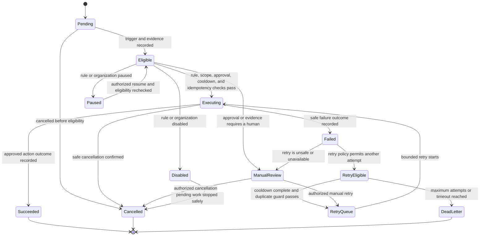

# Automation Lifecycle

**Status:** Planned. This lifecycle defines product states and operational expectations for future deterministic automation. It does not describe an implemented worker or persistence model.

**Related:** [Automation Engine PRD](automation-engine.md) · [Automation Rule Catalog](automation-rules.md) · [Roadmap](../00-overview/roadmap.md)

## Lifecycle overview

An automation begins as a candidate created by an explicit rule trigger. It becomes eligible only after trusted preconditions, tenant scope, policy, pause/disable state, cooldown, and duplicate safeguards are verified. An action may succeed, fail safely, become eligible for a bounded retry, or require human review.

## State definitions

| State | Meaning | Operator expectation |
| --- | --- | --- |
| Pending | Trigger is recorded; eligibility has not completed. | No action is implied yet. |
| Eligible | Trusted preconditions and safeguards permit the documented action. | Work may proceed only through the approved rule. |
| Executing | The explicit action is in progress through its approved boundary. | Observe outcome; do not assume success until recorded. |
| Succeeded | The approved outcome is durably recorded. | Review evidence if needed; no retry occurs. |
| Failed | The action did not complete safely or its outcome is not proven. | Inspect the recorded failure and next state. |
| Retry Eligible | A bounded, documented retry may occur after cooldown. | Await retry or authorized intervention. |
| Retry Queue | A retry passed its gate and awaits or begins bounded execution. | Do not create a second retry manually. |
| Manual Review | A human decision, approval, or remediation is required. | Use the supported operational destination. |
| Paused | Authorized control temporarily stops progression. | Resume requires rechecking eligibility. |
| Disabled | Rule or organization-level control prevents execution. | Pending work is stopped safely; re-enable is explicit. |
| Cancelled | Work was safely stopped before a terminal external effect. | Review audit evidence; do not infer rollback. |
| Dead Letter | Bounded attempts or timeout are exhausted. | Manual remediation is required before any new workflow is considered. |

## Allowed transitions and terminal states

Only the transitions in the diagram are allowed. Every transition records its reason, actor or rule identity, timestamp, organization context, and safe outcome summary.

**Succeeded**, **Cancelled**, and **Dead Letter** are terminal states. A new execution may be considered only through a new explicit trigger or an authorized, documented manual action; it must not silently reopen a terminal record.

## Cancellation, pause, and disable

Cancellation is allowed only when the rule can safely stop without misrepresenting an external effect. Pause is a temporary authorized control at the rule or organization level. Disable prevents future automatic execution for the scope and safely stops pending work where possible.

Organization-level disable has precedence over rule-level eligibility. Resuming or re-enabling never skips the normal tenant, policy, cooldown, approval, and idempotency checks.

## Manual retry and manual review

Manual retry is not a bypass. An authorized operator initiates it only from Manual Review or another documented state, and the engine repeats the same duplicate guards, authorization, and audit requirements used for automated retry.

Manual Review is required when the action is consequential, evidence is incomplete, outcome is ambiguous, policy is unavailable, a limit is exceeded, or a trusted dependency cannot be verified.

## Dead-letter handling

Dead Letter prevents infinite retries. It retains the evidence needed for safe human remediation, but it does not automatically resend, re-run, or create a replacement action. Any follow-up must be an explicit approved workflow with its own idempotency and audit trail.

## Lifecycle guarantees

- No state transition crosses organization boundaries.
- Every state has text status and a safe operational explanation.
- Retry is bounded and idempotent where applicable.
- Failure is recorded before retry or human routing.
- AI advisory output cannot transition a workflow into Executing.
