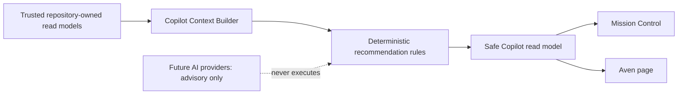

# Aven Operations Copilot

**Status: Current foundation.** Aven is a read-only, deterministic operations briefing surface. It is not a general chatbot, an automation runner, or a source of legal or notarial determinations.

## Purpose and product boundary

Aven turns trusted Avenseal read models into concise, evidence-backed recommendations. It helps staff prioritize recorded operational work without creating facts, changing records, or executing workflows. It follows the [Mission Control PRD](mission-control.md), [Workflow Engine](workflows.md), and [Automation Engine](automation-engine.md).

## Trusted context and availability

The server-side context builder consumes existing Mission Control, Workflow, Payments, Documents, Communications, Attention, and Operations Feed boundaries. It never queries a browser client or exposes repository details. Each domain is marked **available**, **partial**, or **unavailable**. An unavailable source is never treated as zero.

Current context includes the organization-local day, today’s schedule, workflow records, communications attention, payments, documents, Operations Feed items, and unresolved attention when their supported source is available. It is tenant-scoped through the trusted organization resolver; client input cannot select another organization.

## Recommendation contract

Every recommendation has a stable tenant-scoped identity, category, priority, confidence, rule version, safe entity references, descriptive next step, and at least one safe evidence item. IDs incorporate the organization, rule, category, and domain discriminator—not timestamps alone. Evidence contains only safe facts and excludes payloads, credentials, payment details, document contents, signed URLs, identity data, and raw errors.

| Attribute | Current behavior |
| --- | --- |
| Categories | workflow, communication, payment, document |
| Priorities | Critical, high, medium, low; unavailable data never creates a critical recommendation |
| Confidence | High only for direct recorded facts in the initial rules |
| Status | Active or informational; dismiss, snooze, and execution remain future work |
| Actions | Descriptive and read-only; links only open existing admin views |

## Initial deterministic rules

| Rule | Status | Evidence |
| --- | --- | --- |
| Failed communication requires review | Current | Recorded communication attention item |
| Workflow blocked | Current | Explicit Workflow Engine blockers and next action |
| Payment attention | Current when payment source is available | Failed or expired payment record |
| Document attention | Current when document source is available | Awaiting-upload or pending-signature document record |
| Ready for notarization | Current informational | Explicit Workflow Engine stage |
| Approaching appointment, customer follow-up, automation manual review | Deferred | Require additional supported read-model evidence |

Rules are pure where practical, independently testable, and deduplicated by deterministic identity. Results sort by priority, newest evidence, and stable ID.

## Brief, UI, and safety

The daily brief is generated on demand; it is not stored. It states schedule, attention, readiness, top recommendations, freshness, and unavailable sections using deterministic language. Aven appears at [/admin/copilot](/admin/copilot) and as a focused read-only card in Mission Control. The UI offers accessible evidence disclosure, text priority labels, keyboard-visible focus, responsive cards, and a concise disclaimer: Aven provides operational guidance, not legal advice or a determination of notarial eligibility.

## Relationships and future direction

- Mission Control remains the operational dashboard; Aven prioritizes and explains its trusted context.
- The Workflow Engine remains authoritative for stage, blockers, and recommended next action.
- The Operations Feed records activity; Aven may interpret it as evidence but does not duplicate or write events.
- The Customer Timeline is not written by recommendations.
- The Automation Engine may execute approved rules; Aven never executes, approves, retries, or schedules automation.

**Future vision:** a provider-neutral `CopilotLanguageProvider` may summarize supplied structured context or rephrase validated recommendations. It must never query repositories, determine tenancy, invent facts, mutate data, or bypass deterministic rules. Chat, voice, feedback, persisted recommendation lifecycle, OpenAI integration, embeddings, and RAG are explicitly deferred.

## Current limitations

Some repository domains do not yet offer a complete organization-wide persisted source. Aven names those limitations in its availability section rather than implying that there are no problems. All time-sensitive behavior uses the organization timezone when available; configurable time windows are centralized in the deterministic engine.
