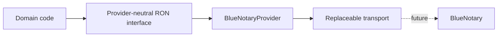

# BlueNotary Provider Adapter

**Status: Contract scaffold; not connected or production-ready.** BlueNotary is Avenseal’s first Connected Service adapter and the reference shape for future provider adapters. Avenseal retains ownership of workflow and customer experience; BlueNotary is isolated to remote online notarization translation.

## Architecture

Only `BlueNotaryProvider` will know endpoint paths, request fields, lifecycle aliases, and response payload shape once BlueNotary supplies them. It implements the Connected Services `RonProvider` contract. An empty, provider-specific `BlueNotaryContractFixture` is the sole insertion point for official paths, methods, DTO serializers, parsers, and auth details. No default endpoint, header, or DTO exists in this repository.

## Verified information

BlueNotary publicly confirms a REST API with API-key authentication, separate Sandbox and Production environments, and API support for creating sessions, document upload, participant/signatory invitations, monitoring session status, retrieving completed documents, webhooks, and signed webhook payloads. The adapter advertises only the matching neutral capabilities: create session, upload document, invite participant, session status, completed documents, webhook events, and signed webhook payloads. A capability declaration is not an indication that Avenseal is configured to call it.

## Capabilities and mappings

No lifecycle values are mapped today. Cancellation, join-link retrieval, recording metadata, signed-document metadata schemas, and generic session retrieval are disabled because public documentation does not verify them. These operations fail with an `unsupported_capability` error. Verified operations fail with a configuration error until an official contract fixture is supplied.

The neutral domain request and response types remain stable, but the adapter makes no assumptions about their BlueNotary translation. Recording URLs, document download URLs, secrets, raw payloads, and session secrets are never exposed.

## Transport and errors

The adapter accepts a replaceable `BlueNotaryTransport`; it does not import `fetch`, an SDK, credentials, or an HTTP client. Without an official fixture it never invokes that transport. The production composition point is intentionally deferred. Errors are typed and retries remain disabled; no polling, retry loop, worker, queue, webhook receiver, or persistence is implemented.

## Information required from BlueNotary

Before enabling any operation, obtain official Sandbox and Production base URLs; exact endpoint paths and HTTP methods; request and response DTOs; API-key header format; status enums; session cancellation and join-link behavior; recording and completed-document schemas; rate limits; timeouts; idempotency requirements; and webhook event, signature algorithm, and header specifications. The contract fixture must then be reviewed, validated with Sandbox, and tested before provider registration.

## Testing and future work

Unit tests prove that no transport request occurs without the official fixture and that unverified operations fail closed. Future work may add secured API-key configuration, Sandbox validation, provider health verification, webhooks, polling, retries, and runtime registry registration after separate authorization and operational design.
