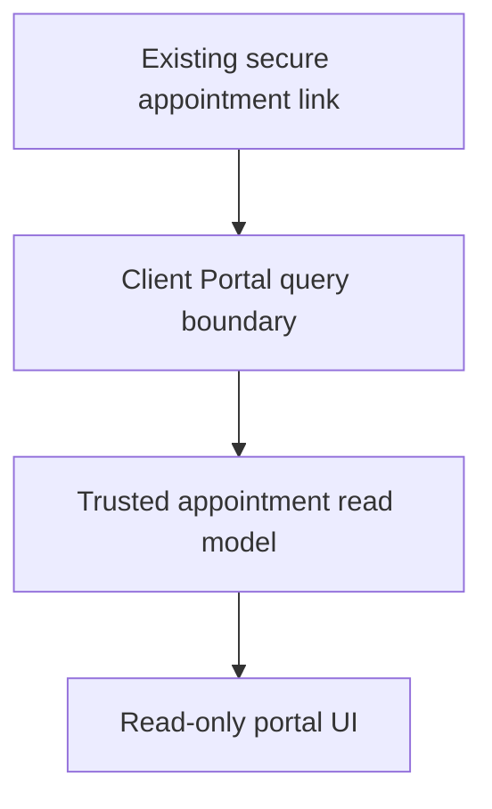

# Client Portal Foundation

**Status: Current foundation.** The Client Portal is Avenseal’s calm, mobile-first, read-only customer workspace. It helps a customer understand their next recorded appointment step; it is not an admin dashboard, a public marketing page, or a general chatbot.

## Architecture and secure context

The initial authenticated route is the existing `/appointments/access/[token]` link. The `/portal` entry route intentionally asks customers to use or request that secure link; this sprint does not add login, accounts, password reset, magic links, or authentication changes. The portal query boundary verifies the access token through the existing server repository boundary and projects only safe, customer-facing data. UI components never query repositories directly.

## Current experience

The secure workspace presents the appointment dashboard, appointment-local countdown, one deterministic next step, preparation checklist, payment status, and honest availability states for workflow, documents, and communications. The next step resolves in this order when trusted context supports it: workflow blocker, payment, documents, preparation, ready, completed. The current secure-link read model supports appointment and payment facts; unsupported domains are unavailable rather than fabricated.

| Domain | Current integration | Customer-safe presentation |
| --- | --- | --- |
| Appointment | Current secure appointment status model | Service, date, time, timezone, status, reference |
| Workflow Engine | Planned secure customer query | Explicit unavailable state; no duplicated workflow rules |
| Payments | Current appointment payment status | Paid, pending, or unavailable; no provider details or payment credentials |
| Documents | Planned secure customer query | Explicit unavailable state; no contents or storage URLs |
| Communications | Planned secure customer query | Explicit unavailable state; no message bodies or provider errors |

The UI uses semantic headings, labeled status text independent of color, keyboard-visible links, responsive cards, and a reduced-motion compatible countdown. It does not upload documents, collect payments, send messages, mutate workflow state, or create records.

## Security and limitations

Tenant isolation remains owned by the existing access-token verification boundary. The portal never exposes internal IDs, provider payloads, payment credentials, document contents, identity documents, admin notes, system metadata, or raw errors. It provides operational appointment information only; it does not provide legal advice or determine notarial eligibility.

**Future vision:** secure customer authentication or magic links, a customer-scoped Workflow Engine read model, uploads, messaging, BlueNotary, payment collection, and an opt-in “Ask Aven” experience all require separate product, security, and authorization work. No provider SDK, polling, worker, queue, or scheduler is added by this foundation.
