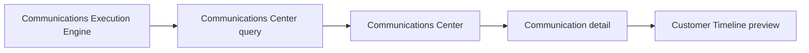

# Communications Center

**Status:** First read-only administrator UI.

The Communications Center is the tenant-scoped place to inspect normalized communication records after they have been created or executed. It is a visibility surface: it does not resend, retry, cancel, edit, delete, or contact a provider.

**Related:** [Communications Execution Engine](communications-execution.md) · [Customer Timeline](customer-timeline.md) · [Automation Engine](automation-engine.md)

## Architecture

The server-side query adapter calls the existing repository boundary, which resolves the organization scope. Pages and presentation components never access Supabase directly. The adapter normalizes safe display fields and does not pass through message bodies, provider payloads, provider identifiers, or raw delivery errors.

## Components and layout

`CommunicationsCenter` contains the server-submitted filters and `CommunicationList`. Each `CommunicationRow` becomes a compact card below the `md` breakpoint and a table row on larger screens. `CommunicationDetail` uses the existing Timeline component for its linked appointment preview; the Timeline is not reimplemented.

Each record shows a purpose, status icon and badge, customer and appointment links when the source record contains them, the current email channel, occurred time, and safe delivery summary. Purpose labels fall back from their typed identifier, so new repository-supported purposes remain readable without a UI release.

## Filtering and search

Filters submit query parameters to the server boundary:

| Filter | Behavior |
| --- | --- |
| Status and purpose | Passed to the existing repository query. |
| Channel | The current persisted Center view represents email only. |
| Customer and appointment | Exact linked identifier filters. |
| Date range | Filters by the normalized occurred timestamp. |
| Order | Newest or oldest first. |
| Search | Customer name, appointment identifier, normalized record ID, or linked message ID. |

Correlation IDs, execution request IDs, provider names, and non-email channel fields are not currently present in the existing normalized repository record. The UI marks those detail fields as not recorded instead of inventing data.

## Status and accessibility

The view retains the existing repository statuses: scheduled, ready to queue, queued, sent (displayed as Delivered), failed, and cancelled. The execution engine’s skipped and unsupported results remain available only where a persisted normalized record supports them.

Forms have visible labels, controls retain the shared focus ring, rows use descriptive links, status icons carry accessible labels, and loading/error states expose `status` and `alert` roles. The layout has no mandatory horizontal scrolling on mobile.

## Future enhancements

Future approved work may expose persisted execution correlation/request data, additional channels, pagination-aware filtering, and retry/resend controls. Those changes require the appropriate execution and repository contracts; this UI does not add them.
