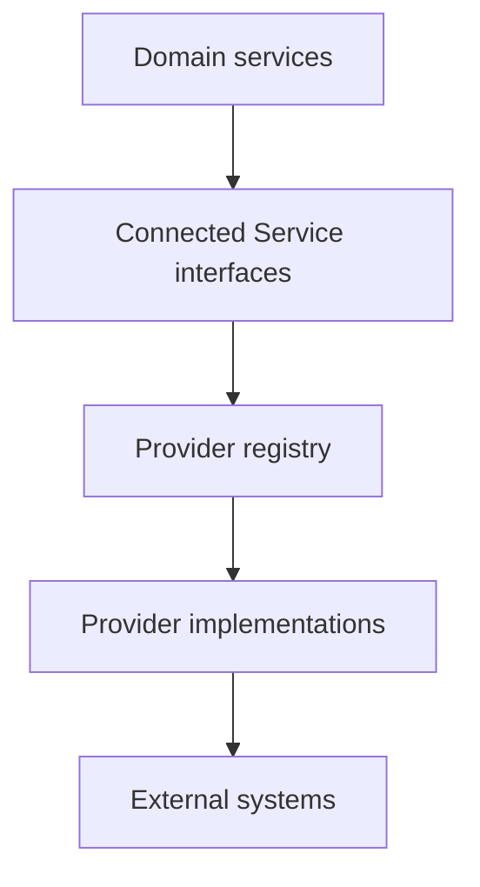

# Connected Services Foundation

**Status: Current architecture foundation.** Connected Services is Avenseal’s provider-neutral integration boundary. Avenseal owns the customer experience, workflow, automation, AI, reporting, and business logic; external providers perform specialized services.

## Architecture

Domain code depends only on typed Connected Service interfaces. It must not import provider implementations. The registry discovers and resolves registered providers, reports their typed capabilities, provides a safe status summary, and leaves future enable/disable decisions at the configuration boundary.

## Provider contract

| Category | Capability examples | Current state |
| --- | --- | --- |
| RON | Create/cancel/retrieve session, join URL, completion and document metadata | Interface only |
| Payments | Create payment, status, refund, receipt | Interface only |
| Storage | Upload, download, delete, metadata | Interface only |
| Messaging | Email, SMS, templates, delivery status | Interface only |
| Calendar | Event lifecycle and availability | Interface only |

Each provider declares its ID, category, display name, version, description, capabilities, and a read-only tenant-scoped status check. Statuses are **available**, **unavailable**, **disabled**, **not configured**, or **unknown**. The admin read model contains safe metadata, capabilities, status, configuration state, and safe detail only; it does not expose configuration values or secrets.

## Errors, audit contracts, and configuration

The foundation normalizes future provider failures into configuration, authentication, rate-limited, unavailable, timeout, validation, or unknown errors. Error messages are deliberately bounded and reject secret-like text. Typed audit-event and configuration contracts define future integration seams only. Neither is persisted or logged by this sprint, and configuration never holds a secret.

## Adding a future adapter

1. Implement the relevant typed provider interface and declare only supported capabilities.
2. Keep network, OAuth, SDK, secret, and provider-specific concerns inside the adapter.
3. Register the adapter at composition time; domain code should continue using the interface.
4. Expose a safe status/configuration projection through the registry.
5. Add tenant-isolation, capability, error, and adapter tests before enabling the provider.

**Future vision:** BlueNotary and Stripe adapters, OAuth, encrypted secret storage, configuration UI, health verification, and provider-specific audit persistence can use this boundary. They are not implemented here. No provider is registered in application runtime, no API call is made, and no existing Google Calendar, Stripe, Workflow, Client Portal, or Mission Control behavior changes.
