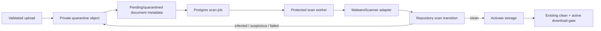
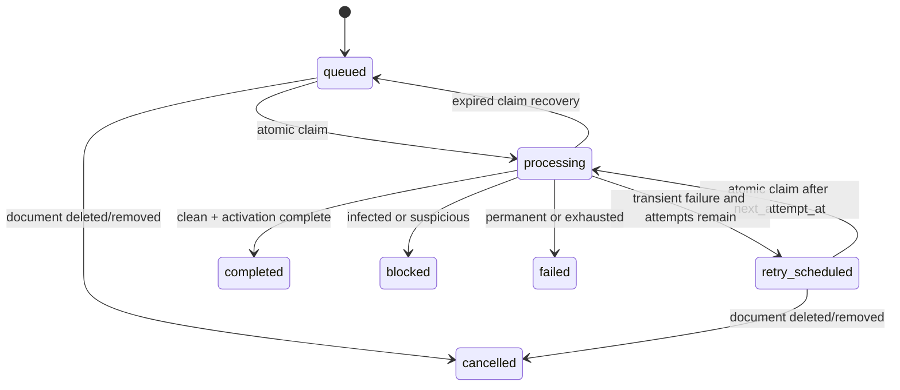
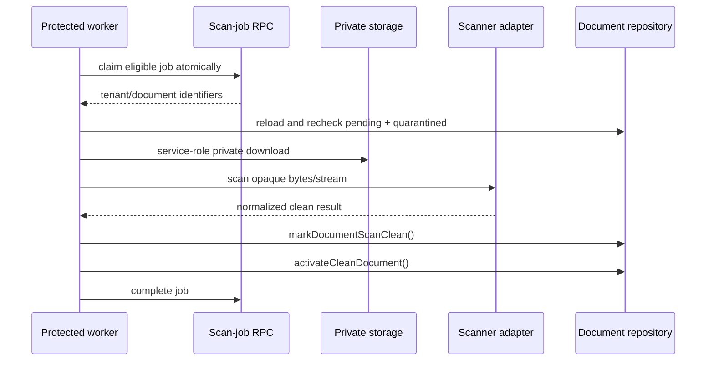

# Document Security Service

**Status:** Planned — Sprint 26.1D-B2A architecture and provider-selection record. This document does not configure a scanner, create a queue, change upload or download behavior, or make any document downloadable.

**Related:** [Secure Document Storage Foundation](secure-document-storage.md) · [Architecture overview](../architecture/overview.md) · [Communications Worker](../engineering/communications-worker.md) · [Mission Control PRD](mission-control.md) · [Codex Playbook](../04-development/codex-playbook.md)

## Decision summary

Sprint 26.1D-B1 deliberately fails closed: validated PDF, JPEG, and PNG uploads enter private quarantine with `scan_status = pending` and `storage_status = quarantined`; only a clean, active record can be downloaded. The missing production capability is a trusted, asynchronous scanner workflow.

This document proposes a server-only **Document Security Service** between quarantine and activation. It will use an adapter, a durable Postgres job queue, a protected worker, existing repository transitions, and safe audits. It is independent of the Client Workspace, admin UI, payments, readiness, BlueNotary, and customer communications.

**Recommendation:** make **Cloudmersive Virus Scan API** the conditional launch candidate, with **OPSWAT MetaDefender Cloud private processing** as the conditional fallback. Neither is approved for production until Security and Legal obtain written answers to the confirmation checklist below, verify the contract/DPA, configure a non-production account, and complete the B2D staging tests. **VirusTotal is rejected for launch**; its private-scanning offering may be evaluated only under a separately approved enterprise agreement. Self-hosted ClamAV is a strategic privacy fallback, not the initial Vercel deployment choice. Verisys remains unselected pending primary-source technical and data-handling documentation.

## Current integration points

| Existing boundary | Current behavior | Future service use |
| --- | --- | --- |
| `lib/server/document-upload.ts` | Validates metadata and signature, writes a private quarantine object, then persists document metadata. | After metadata persistence, enqueue one scan job; the upload still returns a safe processing state and never waits for a scan. |
| `lib/server/document-storage.ts` | Keeps object keys server-only; service-role adapter can download/remove private objects. Maximum accepted size is 10 MiB. | Worker downloads the quarantined object to server memory or a bounded stream. It must not issue a provider-facing signed URL by default. |
| `lib/server/document-repository.ts` | Owns tenant-scoped mapping plus `markDocumentScanClean`, `markDocumentScanBlocked`, `markDocumentScanFailed`, retry reset, activation, removal, and safe audits. | Worker invokes those existing transition methods after rechecking scoped state. A job is not a second source of document truth. |
| Admin download route | Authorizes owner/admin, then permits only clean + active + matching tenant/appointment/document. | Remains unchanged. The service activates storage only after a clean result. |
| Migration `0019` | Enforces scan/storage status sets and `active ⇒ clean`. | B2C adds a separate append-only scan-job migration; it does not weaken these constraints. |
| Communications worker | Uses a protected endpoint, conditional claims, stale-work recovery, bounded retries, and count-only responses. | Supplies the operational pattern for a protected scan worker; it is not reused for scan data or SMTP. |
| Mission Control | Consumes server-owned operational projections. | A later read-only Document Security panel consumes aggregate, safe metrics only. |

## Service boundary



The service owns enqueueing, atomic claiming, private object retrieval, adapter invocation, result normalization, retry scheduling, safe operational metrics, and idempotent completion. It must never:

- decide document review status;
- expose a storage key, bytes, signed URL, provider response, token, or customer data to a browser;
- activate a non-clean document;
- call payment, readiness, external-session, or BlueNotary code; or
- treat scanner configuration absence as a clean result.

### Provider-neutral contract

The future B2B adapter is intentionally narrow:

```ts
interface MalwareScanner {
  scan(request: ScanRequest): Promise<ScanResult>;
}

type ScanRequest = {
  documentId: string;
  contentType: "application/pdf" | "image/jpeg" | "image/png";
  sizeBytes: number;
  bytes: Uint8Array | ReadableStream<Uint8Array>;
  correlationId: string;
  originalFilename?: string;
};

type ScanResult = {
  outcome: "clean" | "infected" | "suspicious" | "retryable_failure" | "permanent_failure";
  provider?: string;
  providerRequestId?: string;
  durationMs?: number;
  failureCategory?: "provider_unavailable" | "provider_timeout" | "rate_limited" | "network" | "invalid_response" | "provider_rejected" | "storage_fetch";
};
```

`originalFilename` is omitted unless a selected API demonstrably requires it. Raw provider bodies, malware signatures/family names, API keys, bucket/key paths, signed URLs, customer identity, and document content do not cross this contract or enter logs/audits.

## Provider comparison and evidence

The table is a decision aid, not a security certification. “Confirmed” means a statement in the linked first-party documentation reviewed on 2026-08-01. Prices, exact limits, retention terms, regional processing, webhook behavior, and support commitments must be reconfirmed in the executed contract because they change by plan.

| Provider | Confirmed facts | Privacy / operational assessment | Decision |
| --- | --- | --- | --- |
| **Cloudmersive Virus Scan API** | Offers file virus-scan endpoints, OpenAPI/Swagger documentation, API-key access, and a documented stateless-processing claim; its FAQ says payload copies are not retained after processing. It lists 600 free calls/month, while paid capacity is plan-based. [API docs](https://api.cloudmersive.com/) · [FAQ](https://cloudmersive.com/faq) | Simple synchronous HTTPS request fits a worker and avoids a provider callback. The public material reviewed does not establish the paid-plan file-size ceiling, region/residency, exact retention under every mode, deletion mechanism, rate-limit contract, or SLA. Private Cloud is an alternative with materially greater operations cost. | **Conditional primary candidate.** Obtain written DPA, no-training/no-sharing, retention/deletion, region, file-size, rate, support, and incident-response commitments first. |
| **OPSWAT MetaDefender Cloud** | API-key-authenticated file analysis is documented. Private scanning requires a paid license and `samplesharing: 0`; docs state private-mode files are not stored/shared and are removed after processing, while result records remain. Private processing restricts result retrieval to the submitting API key. [Private scanning](https://www.opswat.com/docs/mdcloud/operation/private-scanning-with-metadefender-cloud-apis) · [API v4](https://opswat.developerhub.io/docs/mdcloud/metadefender-cloud-api-v4) | Stronger explicit private-processing controls than the public facts found for competitors, but there is asynchronous polling complexity and result retention. Confirm private processing is included in the purchased tier, regional processing, retention/deletion of result metadata, file limit, timeouts, rate limits, webhook availability, and DPA. | **Conditional fallback candidate.** Promote to primary only if its contract/privacy posture and operational tests beat Cloudmersive. |
| **ClamAV, self-hosted** | Open-source GPLv2 toolkit; `clamd` is a long-running daemon and supports streamed file contents. Its published minimum guidance is 3 GiB RAM and 5 GiB disk. [Overview](https://docs.clamav.net/) · [daemon protocol](https://docs.clamav.net/manual/Usage/ClamdProtocol.html) | Best data locality and no third-party file transfer if Avenseal hosts it. It requires a persistent, monitored compute service, signature updates, capacity, network hardening, alerting, and operations outside Vercel functions. Detection breadth/compliance must be evaluated separately. | **Strategic privacy fallback, not launch fallback.** Revisit if DPA/residency requirements preclude cloud scanning. |
| **VirusTotal** | Private-scanning endpoints require a private-scanning license; docs allow a requested retention period of 1–28 days and US/EU storage selection. Public API terms prohibit commercial-product use; private analyses have product-specific characteristics. [Private files](https://docs.virustotal.com/reference/private-files-api) · [API overview](https://docs.virustotal.com/docs/api-overview) | Even private mode transfers highly sensitive files to a malware-analysis service and retains file/report material for a period. It is unsuitable as the default scanner for notarization documents without an exceptional, contractually approved privacy review. | **Rejected for launch.** No public/community API use; do not upload customer documents. |
| **Verisys Antivirus API** | No sufficiently detailed first-party API, privacy/retention, region, pricing, file-limit, retry, or deletion documentation was verified in this review. | A provider cannot be assessed for sensitive documents from marketing or secondary commentary. | **Unselected.** Require official API reference, DPA, data-flow description, and commercial terms before reconsideration. |

### Provider confirmation gate

Before selection, request written answers for every candidate: processing region and subprocessor list; whether bytes, hashes, filenames, or result metadata are retained, trained on, shared, or recoverable; deletion SLA; DPA/security addendum; file-size and rate ceilings; timeout/SLA; retry/idempotency semantics; API authentication and rotation; callback/webhook design; incident notification; audit export; US data-residency availability; and pricing/overages. Avenseal must test a 10 MiB PDF/JPEG/PNG and an EICAR fixture only in a vendor-approved isolated staging account.

## Synchronous versus asynchronous decision

| Model | Benefits | Material risks | Decision |
| --- | --- | --- | --- |
| Synchronous scan in upload request | Simple request path and immediate verdict. | Provider latency sits on a customer request; Vercel/function timeout and 10 MiB buffering risk failed uploads; provider outages create poor UX; no durable retry/claim/recovery boundary. | Do not use for launch. |
| Asynchronous queued scan | Upload remains bounded: validate, quarantine, persist, return processing. Worker controls timeout, concurrency, retries, and health metrics. | Requires durable jobs and operations visibility. | **Recommended target.** |

The worker fetches bytes through the service-role private-storage adapter. At today’s 10 MiB maximum, a full `ArrayBuffer` is acceptable only with bounded per-worker concurrency and explicit memory limits; use streaming only where the chosen provider accepts it. Do not hand the provider a signed URL unless a reviewed integration makes that necessary and limits its scope, lifetime, and audience.

## Queue, concurrency, and lifecycle

### Proposed B2C migration

Create one append-only `document_scan_jobs` table. It contains no file bytes, keys, URLs, tokens, filenames, or provider raw data.

| Field | Purpose |
| --- | --- |
| `id`, `organization_id`, `appointment_request_id`, `document_id` | Immutable, tenant-scoped job identity; unique active job per document. |
| `status` | `queued`, `processing`, `retry_scheduled`, `completed`, `blocked`, `failed`, `cancelled`. |
| `attempt_count`, `next_attempt_at` | Bounded retry scheduling. |
| `claimed_at`, `claimed_by`, `claim_expires_at` | Lease-based worker ownership and stale-claim recovery. |
| `last_failure_category`, `provider`, `provider_request_id`, `completed_at` | Safe operational facts only. |
| `created_at`, `updated_at` | Durable ordering and diagnosis. |

The job status is execution state; `appointment_document_files.scan_status` remains the security result source of truth. A unique partial index should prevent more than one active job for a document, and tenant/document foreign keys should preserve ownership.



Use a `SECURITY DEFINER` Postgres claim RPC with a fixed search path and service-role-only execution, patterned after the reminder promotion boundary. One statement selects eligible work with `FOR UPDATE SKIP LOCKED`, asserts lease eligibility, updates it to `processing`, and returns only safe job/document identifiers. Lookup-then-update is prohibited. Before scanning and before each transition, the worker reloads the document under organization, appointment, document, non-deleted, and quarantine state; clean/active and terminal blocked states become idempotent no-ops. Expired leases return to `queued` only when the document remains eligible.

### Retry and failure policy

Use **five total attempts** (initial + four retries), with full jitter around base delays of **1, 5, 20, and 60 minutes**, capped at **6 hours** from first claim. A worker uses a provider request timeout of **45 seconds** by default, constrained below its host execution limit. Limit batch concurrency to a measured safe value (initially 2) and cap one job’s whole attempt at 90 seconds.

| Condition | Normalized outcome | Job action | Document state |
| --- | --- | --- | --- |
| Provider unavailable, timeout, network fault, HTTP 429/5xx, transient storage fault | `retryable_failure` | reschedule while attempts remain; otherwise terminal failure | Remains `pending` while retry is scheduled; `failed` after exhaustion. Always quarantined. |
| Malformed/unknown provider response | `permanent_failure` unless provider documents a safe retry classification | fail terminal and alert | `failed`, quarantined. |
| Provider rejects invalid request/file | `permanent_failure` | fail terminal | `failed`, quarantined. |
| Infected or suspicious | `infected` / `suspicious` | block; no automatic retry | terminal blocked result, quarantined. |
| Scanner misconfigured/disabled | no adapter call | fail job safely and alert | `failed`, quarantined. |

Manual retry is limited to an authorized operation after configuration/incident review; it calls the existing retry reset, creates/reuses a job, and preserves attempt history. There is no automatic retry for infected, suspicious, or permanent rejections. A manual clean override is **high risk and not recommended for launch**.

## Processing flows

### Clean activation



If a failure occurs after `markDocumentScanClean()` but before activation, the document is clean/quarantined and non-downloadable. A replay detects that safe intermediate state, retries activation through the guarded repository method, and completes the job. If activation succeeds but job completion fails, replay observes clean/active and completes without another activation audit. The database constraint prevents `active` with a non-clean result; download remains guarded by both fields.

### Blocked and failed outcomes

For `infected`, call `markDocumentScanBlocked(infected)` (or extend the existing safe blocked-category vocabulary in B2C), leave the object quarantined, record a safe audit, and create an operational alert. For `suspicious`, do the same but route it to a future staff manual-review policy. Neither customer-facing message contains malware details.

Retryable failures leave the document pending/quarantined until exhaustion. On exhaustion or a permanent failure, call `markDocumentScanFailed()`, retain quarantine, expose only a safe admin category, and alert operations. A retention policy may later remove blocked objects with `markDocumentStorageRemoved()`; it must never delete evidence before the approved retention window or any required incident process.

## Privacy, health, and operations

### Data handling

Only the worker may send document bytes to the selected provider. It uses an opaque document ID and correlation ID, omits filenames unless required, keeps no bytes in the queue, redacts provider responses, and records only an approved request ID where necessary for support. Security/Legal must determine customer notice, lawful basis, contract/DPA, US processing/residency, retention, deletion, subprocessor obligations, and support-access controls before launch.

### Configuration plan

These are **planned**, server-only environment values; B2A does not add them to `lib/env.ts`:

| Variable | Planned use |
| --- | --- |
| `DOCUMENT_SCANNER_PROVIDER` | Explicit adapter selection. |
| `DOCUMENT_SCANNER_API_KEY` | Provider credential; never browser-visible or logged. |
| `DOCUMENT_SCANNER_BASE_URL` | Reviewed provider endpoint override. |
| `DOCUMENT_SCANNER_TIMEOUT_MS` | Bounded per-attempt request timeout. |
| `DOCUMENT_SCANNER_MAX_ATTEMPTS` | Retry cap, validated with an upper bound. |
| `DOCUMENT_SCANNER_ENABLED` | Explicit production enablement after staging sign-off. |
| `DOCUMENT_SCAN_WORKER_SECRET` | Bearer authentication for protected worker invocation. |

Missing/invalid production configuration is **misconfigured** and fails closed. Development/test may use an explicit deterministic fake adapter only; there is no implicit clean fallback.

### Health and Mission Control plan

`healthy`, `degraded`, `unavailable`, and `misconfigured` are future derived states. The worker records last successful scan, last safe failure category, rolling failure rate, queue depth, oldest pending job, retry backlog, and average duration. It must not surface credentials, raw reports, filenames, keys, URLs, tokens, or customer details.

A later Mission Control Document Security panel is read-only and tenant-scoped: pending, clean, blocked, failed, retry backlog, oldest pending age, health, and average scan duration. Drill-down links may target a filtered admin document/appointment view only after that view and its authorization model exist; they do not link to objects or scanner reports.

### Audit contract

Future service events are `document.scan_job_created`, `document.scan_started`, `document.scan_clean`, `document.scan_blocked`, `document.scan_failed`, `document.scan_retry_scheduled`, `document.storage_activated`, and `document.storage_removed`. Metadata is limited to document ID, attempt count, provider name, normalized result, duration, and safe failure category. It never contains bytes, filename, storage key, signed URL, raw response, signature name, customer token, credential, or provider request headers.

## Test, cost, and security plan

### B2B–B2D tests

| Slice | Required verification |
| --- | --- |
| Adapter/configuration | Each normalized result, timeout, malformed response, missing configuration, and no raw-data leakage. |
| Queue/worker | Atomic claim, duplicate-worker prevention, stale claim recovery, retry delays, exhaustion, state revalidation, clean activation, blocked/failed quarantine, and idempotent replay. |
| Privacy | No key, token, filename, raw response, or bytes in logs/audits/metrics/projections. |
| Staging | Clean PDF/JPEG/PNG, provider outage, bounded 10 MiB file, and provider-approved EICAR handling in an isolated account. Never execute live malware tests in ordinary development. |

### Planning cost model

Assume **1.5 scanned files per appointment** until production data exists: 100 appointments/month ≈ 150 scans; 500 ≈ 750; 1,000 ≈ 1,500. Monthly provider cost is `scan volume × contracted per-scan price`, plus any minimum platform fee and overages. Cost per appointment is `1.5 × contracted per-scan price` plus a small allocation for database rows, private storage, and scheduled worker invocation. Current public materials do not establish comparable production prices for all candidates; procurement must collect written monthly minimums, included scans, overage price, data-region price differences, and support tier before choosing a vendor.

| Risk | Mitigation / residual risk |
| --- | --- |
| Provider sees sensitive documents or is compromised | DPA, private-processing terms, minimum metadata, server-side upload, region review, vendor due diligence. Residual third-party processing risk remains. |
| Sample retention/sharing | Written no-sharing/no-training/deletion commitments; reject vendor if insufficient. |
| URL/key/credential leakage | Never issue provider signed URLs by default; server-only secrets; redacted logs/audits. |
| Duplicate scan or activation race | Atomic job claim, unique active job, optimistic repository transitions, idempotent rechecks. |
| Outage or retry storm | Fail closed, bounded exponential jitter, concurrency cap, health alerts, manual retry. |
| Large/malicious file or false verdict | Existing 10 MiB/type/signature checks, provider limits, timeouts, quarantine, staff process for suspicious/false positives. False negatives remain a residual malware-detection risk. |
| Queue poisoning or worker replay | Strict job schema, service-role RPC, protected endpoint, scoped rechecks, leases, audit trail. |

## Delivery roadmap and launch blockers

| Slice | Independently reviewable scope |
| --- | --- |
| **B2B — Scanner Adapter and Configuration** | Define interface, selected adapter, deterministic fake adapter, response normalization, config validation, and timeout handling. |
| **B2C — Scan Queue and Worker** | Append-only migration, atomic claim RPC, protected worker, stale recovery, retries, repository transitions, clean activation, and safe audits. |
| **B2D — Operations and Staging Verification** | Health aggregates, future Mission Control projection, controlled manual retry, runbook, clean-file/EICAR/outage staging verification. |

**Launch remains blocked.** Production uploads must remain pending/quarantined and non-downloadable until: a provider is selected and contractually approved; B2B/C are implemented and reviewed; worker credentials/configuration are present; staging verifies clean, blocked, outage, concurrency, and privacy paths; and Operations accepts the runbook and monitoring.
