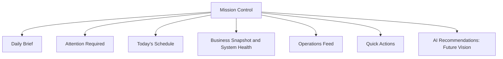
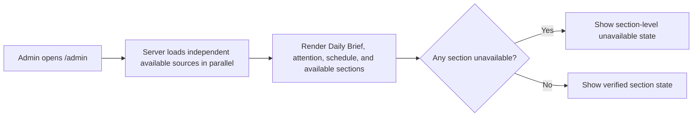
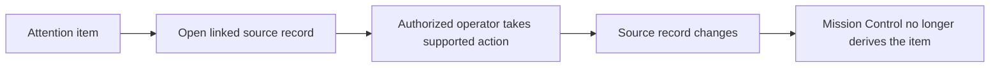
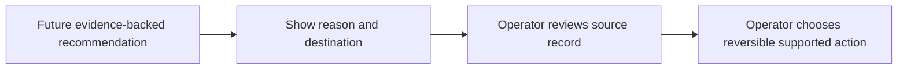
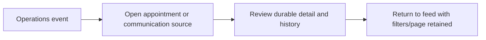

# Mission Control PRD

**Status:** Planned product requirements. This document does not claim that the complete Mission Control experience is implemented.

**Related:** [Vision](../00-overview/vision.md) · [North Star](../00-overview/north-star.md) · [Roadmap](../00-overview/roadmap.md) · [Design Principles](../01-design-system/design-principles.md) · [Codex Playbook](../04-development/codex-playbook.md) · [Architecture Overview](../architecture/overview.md)

## Related UI specification

The [Mission Control UI Specification](mission-control-ui.md) defines visual hierarchy, responsive behavior, component anatomy, interaction rules, and user-facing states. This PRD remains the source for product scope, data boundaries, and acceptance behavior; avoid duplicating UI detail here.

## 1. Executive summary

Mission Control is Avenseal’s default operational homepage for a notary administrator. It consolidates verified signals from appointments, scheduling, communications, reminders, and integrations into an ordered answer to four questions: what needs attention, what is happening today, what is operating normally, and what should happen next.

It matters because operational truth is currently distributed across appointment, customer, settings, integration, and communication surfaces. Mission Control should reduce context switching without hiding the durable record or automating notarial judgment.

## 2. Problem statement

Independent notaries coordinate appointment requests, reminders, calendar activity, payments, and customer follow-up under time pressure. When records are spread across separate pages, the operator must remember where to look, infer whether a workflow completed, and manually connect customer context to operational failure. That creates missed reviews, late follow-up, and unnecessary administration.

Mission Control is not a generic analytics dashboard. It is an operational decision surface built from verified data. It must not manufacture “healthy” systems, revenue claims, provider delivery, overdue payment, or customer-response signals that the repository cannot prove.

## 3. Product goal

Make Mission Control the default admin homepage so a notary can immediately:

- identify the next required action;
- understand today’s appointment workload;
- distinguish verified normal configuration from attention requiring action; and
- navigate to the underlying record in one interaction when possible.

## 4. North Star alignment

| North Star outcome | Mission Control contribution |
| --- | --- |
| Reduce administrative work | Prioritizes work instead of requiring a scan across multiple admin pages. |
| Improve customer clarity | Prompts timely review and follow-up from durable customer/appointment context. |
| Preserve professional control | Provides decision support and navigation; it does not approve appointments, send messages, or make notarial determinations autonomously. |
| Data before decoration | Uses persisted records and labels uncertainty explicitly. |

## 5. Primary users

| User | Need | First-release implication |
| --- | --- | --- |
| Independent remote online notary | Decide what to review, prepare, or recover today | Default operational homepage with concise attention and schedule |
| Mobile notary | Check urgent work between appointments on a small screen | Attention and schedule remain first in the reading order |
| Small notary team owner | Understand business operations without reading every record | Verified summary and links to source records |
| Future staff member or operations coordinator | Route operational work without broad permissions | **Future Vision:** role-specific actions require explicit authorization design |

## 6. Jobs to be done

1. At the start of the day, know what requires action without opening several pages.
2. Before an appointment, see its customer, service, time, status, and appropriate destination action.
3. Recover from a verified communication or calendar failure using its source record.
4. Confirm that configuration-backed workflows are enabled without inferring provider health.
5. Navigate from a signal to the relevant appointment, communications, settings, or integrations page quickly.

## 7. Scope classification

| Classification | Capability |
| --- | --- |
| **Current** | Admin homepage already has greeting/date, settings-derived attention, system-health cards, appointment metrics, quick actions, upcoming appointments, recent customers, and awaiting-review workflow. |
| **Current** | Repository exposes appointments, customers, organization settings, integrations, appointment-level calendar events/history, and normalized communications records/metrics. |
| **Planned** | Mission Control normalizes those sources into section-level view models, partial-failure states, richer attention rules, and a paginated operations feed. |
| **Future Vision** | AI recommendations, role-tailored workspace, configurable layout, team workload, revenue insight, voice activity, and document-intelligence alerts. |
| **Out of scope: first release** | Autonomous appointment approval, sending/retrying messages without a user action, provider-health claims without verified data, payment-due logic without policy/source data, and AI legal/notarial decisions. |

## 8. Information architecture

| Section | Priority | Purpose | First-release status |
| --- | --- | --- | --- |
| Daily Brief | 1 | Orient the operator to today and the highest-level verified workload | Planned refinement of current greeting |
| Attention Required | 1 | Surface actionable issues with a destination | Current foundation; planned richer rules |
| Today’s Schedule | 1 | Show current/upcoming/completed appointment context | Current foundation; planned schedule grouping |
| Business Snapshot | 2 | Show trustworthy operational counts | Current foundation |
| System Health | 2 | Explain configuration/integration status from real data | Current foundation; planned status model |
| Operations Feed | 3 | Provide chronological cross-domain evidence | Planned |
| Quick Actions | 3 | Route to frequent, supported destinations | Current foundation |
| AI Recommendations | 4 | Offer reversible, evidence-backed suggestions | Future Vision |



## 9. Daily Brief

The brief is a concise server-rendered summary. Example: “Good morning. You have 5 appointments today, 2 awaiting review, and 3 reminders scheduled.” Do not show an administrator’s name until a safe, authoritative profile field is available; the current admin session does not establish a display-name source.

| Condition | Rule |
| --- | --- |
| Greeting | Morning before 12:00, afternoon before 18:00, evening thereafter, using the organization timezone where available. |
| Timezone | Resolve from organization settings; if unavailable, display a neutral summary and avoid timezone-specific claims. |
| No activity | State that no appointments or attention items are recorded today; link to appointments/settings as appropriate. |
| Urgent activity | Lead with count and highest-priority attention item, never fabricated urgency. |
| Partial data | Say which section is unavailable and retain useful sections. |
| Failure state | Do not fail the page; use a safe “status unavailable” explanation and retry on next request. |

## 10. Attention Required

An item qualifies only when a persisted record or configuration proves an operator action is needed.

| Signal | Classification | Priority | Required action | Destination |
| --- | --- | --- | --- |
| Appointment awaiting review | Current data | High when requested time is approaching; otherwise normal | Review/request clarification | Appointment detail or review queue |
| Failed communication | Current data | High | Inspect and retry only if eligible | Communication detail |
| Calendar sync failure | Current data at appointment level | High for a confirmed/ready appointment; otherwise normal | Inspect event/retry path | Appointment calendar detail or integrations |
| Reminder ready to queue / failed linked message | Current data | Normal or high based on appointment proximity | Inspect communications/reminder record | Communications Center |
| Email reminders or confirmations disabled | Current configuration | Normal | Review setting | Settings |
| Overdue payment | Planned | Not shown until payment policy defines due/overdue evidence | — | — |
| Customer response needed | Future Vision | Not shown until a durable inbound-response model exists | — | — |

### Rules

- Sort by priority, then appointment proximity, then event timestamp descending.
- Every item includes a plain-language reason, customer/appointment context when available, one supported destination, and text priority—not color alone.
- First release has no persistent dismissal. An item resolves only when its source record/configuration resolves; this avoids hiding real work. A future user-specific dismissal requires auditability, expiry, and a reopen rule.
- Deduplicate the same source condition and appointment into one item; the detail page remains the source of truth.

## 11. Today’s Schedule

The schedule is scoped to the organization business day and grouped as current, upcoming, and completed where appointment state/time can support that distinction.

| Field | Requirement |
| --- | --- |
| Appointment timezone | Use organization timezone; do not use UTC date slicing for a business-day view. |
| Record context | Customer name, service snapshot when available, start/requested time, appointment status, and source appointment link. |
| Join/open action | Show only when an existing meeting URL or supported appointment action exists. Do not invent a join destination. |
| Current appointment | Identify by time window only when a reliable start/end duration is available; otherwise omit the “current” label. |
| Completed | Use persisted `completed` status, not elapsed clock time. |
| Empty state | Explain that no appointments are recorded for the organization day and route to appointment review/booking only where supported. |

## 12. Business Snapshot

First-release metrics must be global to the organization and based on trustworthy persisted data.

| Metric | Status | Source / limitation |
| --- | --- | --- |
| Appointments today | Current | Appointment preferred date, calculated in organization timezone |
| Awaiting review | Current | Appointment status |
| Communications scheduled | Current foundation | Normalized communications/reminder records |
| Communications failed | Current foundation | Normalized communications records |
| Upcoming appointments | Current | Future requested appointment date/time, sorted chronologically |
| Completed appointments | Current | Appointment status |
| Revenue/payment summary | Planned | Payment records exist, but a Mission Control revenue definition and reconciliation policy are not yet specified |
| Overdue payments | Planned | No durable due/overdue policy is currently defined |

## 13. System Health

Health is a textual, evidence-backed status—not a provider service-level assertion.

| Area | Healthy | Needs attention | Degraded | Unknown |
| --- | --- | --- | --- | --- |
| Communications | Confirmations/reminders enabled and no known failed record in selected scope | Required messaging setting disabled or failed communication recorded | Not used until a supported aggregate degradation rule exists | Source unavailable or provider health cannot be proven |
| Reminder queue | Scheduled reminders exist without known failure/overdue promotion issue | Due reminder is ready to queue or linked communication failed | Not used until worker timing/reliability thresholds are defined | Reminder data unavailable |
| Calendar sync | Connected integration plus no known relevant sync failure | Relevant appointment calendar mapping failed | Not used until aggregate sync latency/error policy exists | Integration/mapping status cannot be loaded |
| AI Concierge | Configuration enabled | Configuration disabled | Not applicable in first release | Configuration unavailable |

All cards include status text, evidence detail, and a destination. Green styling may accompany a verified configuration state but never proves SMTP, Google, or AI provider availability.

## 14. Operations Feed

**Planned.** The feed is a normalized, paginated chronological view—not a client-side merge of unbounded records.

| Event | Likely source | Context |
| --- | --- | --- |
| Appointment created / status changed | `appointment_requests`, `status_history`, `audit_logs` | Appointment and customer |
| Confirmation/reminder queued, sent, failed | `communication_messages`, `appointment_reminders`, delivery events | Appointment/customer when linked |
| Calendar event created/failed | `calendar_event_mappings`, integration data | Appointment |
| Appointment completed | Appointment status history | Appointment/customer |

Each event needs timestamp, event type, actor where recorded, customer context when safely joined, appointment link, and source identifier. Pagination defaults to a bounded page with “Load more”; order is newest first. Deduplicate only semantically identical source events sharing source ID/type, never hide distinct retries. The empty state states that no operational events are recorded in the selected period.

## 15. Quick Actions

First release keeps actions focused: **Review appointments**, **Open communications**, **Open settings**, and **Open integrations**. “Create appointment,” “View calendar,” and “Open AI Concierge” are shown only if a supported route/workflow exists; they are not required to make the page feel complete.

## 16. AI Recommendations

**Future Vision:** recommendations are decision support, never autonomous execution. A recommendation may suggest reviewing an appointment near its requested time, opening a failed communication eligible for retry, or following an unresolved request only when real data supports the condition.

Each recommendation must show its evidence, reason, and reversible destination action. It cannot fabricate urgency or send, approve, modify, or dismiss data automatically. When no evidence-backed recommendation exists, show a calm empty state: “No recommendation is available from the current operational data.”

## 17. User flows

### Opening Mission Control



### Resolving attention



### Following an AI recommendation



### Navigating operations feed



## 18. Data sources and gaps

| Domain | Current likely source | Gap |
| --- | --- | --- |
| Appointments/customers | `repository.listAppointments()`, `listCustomers()`, appointment detail/history | Needs dedicated timezone-aware day query for scale |
| Communications | `listAdminCommunications()`, `getCommunicationMetrics()`, normalized `admin_communications` view | Needs feed-ready event model and safe aggregation policy |
| Reminder jobs | `appointment_reminders` and normalized communications view | Needs repository summary for overdue/promoted state by business day |
| Calendar sync | Appointment calendar mappings and `listIntegrations()` | Needs global, scoped failure query and aggregation policy |
| Payments | Appointment payment records | No agreed Mission Control revenue/due/overdue model |
| AI Concierge | Organization settings | No deployed recommendation engine or auditable recommendation store |

## 19. Repository and API requirements

- Use a Server Component-first page.
- Add repository-owned Mission Control queries/view models; presentation components do not contain business rules.
- Load independent sources with `Promise.all` where safe.
- Prefer database filtering, bounds, and pagination over loading all records into React.
- Return section-level result states so one unavailable subsystem does not fail the page.
- Preserve organization resolution, server authorization, RLS, and customer-safe error handling.

## 20. Suggested view model

Illustrative only; production types belong with the Mission Control repository boundary.

```ts
type DailyBrief = { greeting: string; timezone: string | null; summary: string; dataState: "complete" | "partial" };
type AttentionItem = { id: string; priority: "high" | "normal"; title: string; reason: string; href: string; source: string; appointmentId?: string };
type ScheduleItem = { appointmentId: string; customerName: string; serviceName: string | null; startsAt: string; timezone: string; status: string; action?: { label: string; href: string } };
type SnapshotMetric = { id: string; label: string; value: number | null; state: "available" | "unavailable"; detail?: string };
type HealthStatus = "healthy" | "needs_attention" | "degraded" | "unknown";
type OperationsEvent = { id: string; occurredAt: string; type: string; actor: string | null; customerName: string | null; appointmentId: string | null; href?: string };
type QuickAction = { id: string; label: string; href: string; available: boolean };
type Recommendation = { id: string; reason: string; evidence: string; action: { label: string; href: string }; reversible: true };
```

## 21. Loading, empty, error, and partial states

| Section | Loading | Empty | Error / partial |
| --- | --- | --- | --- |
| Daily Brief | Stable summary skeleton | “No activity is recorded today.” | Neutral partial-data sentence; retain other counts |
| Attention | Compact placeholder | “No action is required from the available data.” | “Attention status is unavailable” with safe retry on next request |
| Schedule | Ordered row skeleton | No appointments for organization day | Section error, not page failure |
| Snapshot/Health | Fixed-card skeleton | Not applicable | Mark individual metric/card unavailable; never substitute zero |
| Operations Feed | Bounded row skeleton | No events in selected period | Preserve filters and show retry/load guidance |
| Recommendations | Omit until feature exists | No recommendation available | Do not fabricate fallback guidance |

## 22. Responsive design

| Viewport | Behavior |
| --- | --- |
| Desktop | Two-column operational layout after the top-priority brief/attention/schedule; feed uses dense table/list conventions |
| Tablet | Stack secondary regions while retaining schedule and attention prominence |
| Mobile | Daily Brief, Attention Required, and Today’s Schedule appear first; actions remain large enough to tap; details use progressive disclosure |

Follow the [Design Principles](../01-design-system/design-principles.md): preserve semantic reading order, text status, visible focus, and deliberate responsive table behavior.

## 23. Accessibility

Mission Control requires keyboard navigation, visible focus states, semantic headings/landmarks, explicit accessible labels, status text in addition to color, WCAG AA contrast, and reduced-motion support. Use `aria-live` only for genuinely dynamic client updates; a server-rendered page load does not require it. Feed and attention links must identify their destination and context without relying on nearby visual layout.

## 24. Performance

- Useful top-of-page content should appear quickly from server-rendered, bounded data.
- Independent section queries load in parallel where safe.
- Avoid unnecessary client-side fetching and hydration.
- Reserve stable layout dimensions for cards/rows to prevent layout shift.
- Use database pagination for the operations feed and bounded source queries for attention.

## 25. Security and privacy

Mission Control inherits admin authentication and server-side organization authorization. All tenant data is scoped by `organization_id`; RLS remains the database control. Show only operationally necessary customer context, avoid sensitive document/identity data in summaries, never expose credentials/provider tokens, and log only safe identifiers and summaries. A future staff role must receive the least privilege necessary; it cannot inherit owner/admin actions by UI visibility.

## 26. Success metrics

| Goal | Classification | Evidence |
| --- | --- | --- |
| Identify next required action within 10 seconds | Planned | Usability evaluation or operator observation plan |
| Reach appointment review in one click from an attention item | Initial-release criterion | Link behavior/E2E coverage |
| Reach primary operational destinations within three clicks | Current design requirement | Route and responsive review |
| No fabricated system health | Initial-release criterion | View-model and UI assertions against source states |
| Remain useful during partial failure | Initial-release criterion | Section-level partial-failure tests |

## 27. Acceptance criteria

1. `/admin` remains server-rendered and loads independently available Mission Control data in parallel.
2. Each attention item has a persisted/configuration-backed reason, text priority, and supported destination.
3. A failed or unavailable subsystem does not replace useful page sections with a full-page failure.
4. Today’s schedule uses organization timezone and does not label an appointment complete solely because time passed.
5. Metrics display only trustworthy values; unavailable values are labeled unavailable rather than shown as zero.
6. Health cards use Healthy, Needs attention, Degraded, or Unknown text and never claim provider health without supporting data.
7. Operations Feed is paginated, source-linked, timestamped, and empty-state aware before it is released.
8. AI Recommendations are not rendered until an evidence-backed, authorized recommendation source exists.
9. Keyboard, visible focus, text status, WCAG AA contrast, loading/empty/error states, and responsive behavior are verified.

## 28. Testing strategy

| Level | Coverage |
| --- | --- |
| Repository | Organization scope, bounds/pagination, status derivation, and partial-source errors |
| View model | Daily brief, priority/sort/deduplication, timezone handling, metrics unavailable behavior, health classification |
| Components | Status text, destinations, empty/error/loading states, no false health claims |
| Accessibility | Keyboard traversal, accessible names, focus, semantic heading/table/list structure, contrast review |
| Responsive | Desktop/tablet/mobile order and schedule/attention usability |
| Partial failure | Each source unavailable independently while the rest of the page remains useful |
| E2E | Open dashboard, follow attention, review appointment, open communication, preserve feed pagination/filter state |

Run the repository validation requirements in the [Codex Playbook](../04-development/codex-playbook.md), including integration/E2E checks when repository, RLS, or user flows change.

## 29. Rollout plan

1. Release internally behind a feature flag if the deployment environment supports a safe existing flag mechanism; do not add a superficial flag solely for this page.
2. Validate with seeded development data and controlled real/staging data where permitted.
3. Compare displayed signals against source records; do not use placeholder metrics.
4. Monitor page/repository errors, incomplete-source states, and operator feedback.
5. Expand section coverage iteratively only after data semantics and operational ownership are clear.

## 30. Open questions

1. What exact appointment time semantics define “today” and “current” across organization timezone, requested time, and scheduled duration?
2. Which payment policy makes a payment “overdue,” and where will due state be persisted?
3. What inbound customer-response source and privacy policy support “customer response needed”?
4. Which calendar sync failures should be globally visible, and what recovery action is authorized?
5. Should attention dismissals be user-specific, auditable, time-limited, or absent in the first release?
6. What event schema and retention policy supports a unified operations feed without broad client-side merging?
7. What evidence, audit trail, and permissions are required before AI recommendations can be shown?

## 31. Future enhancements

**Future Vision:** richer analytics, payment/revenue summaries, team workload, voice-receptionist activity, document-intelligence alerts, customizable layout, and a more advanced AI Operations Assistant. Each requires its own PRD, data model, privacy/security review, and North Star evaluation before implementation.
