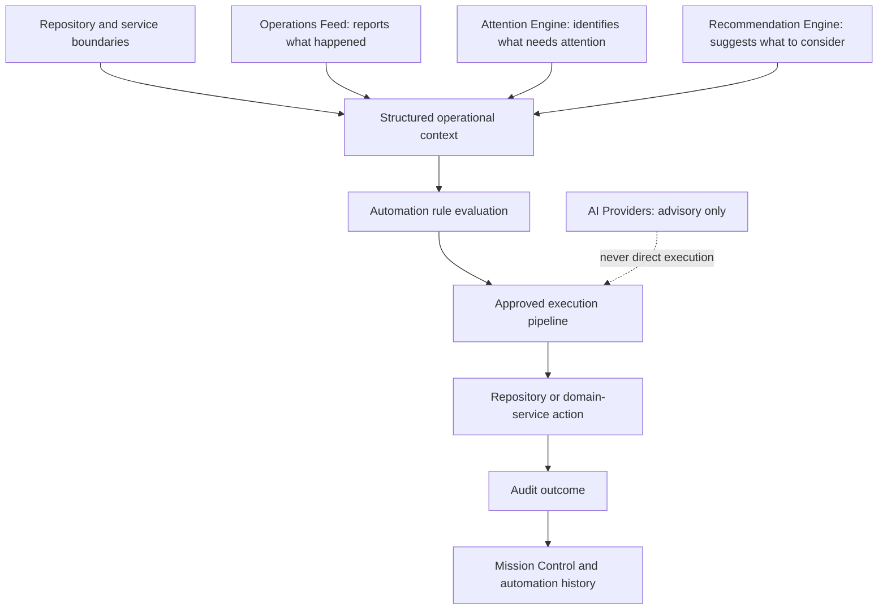

# Automation Engine Engineering Contract

**Status:** Planned. This document is a technology-aware internal development contract for the future Automation Engine. Its interfaces and examples are proposed and may be refined during implementation, but no refinement may weaken the safety invariants in this document or the related product documents.

**Related:** [Automation Engine PRD](../03-product/automation-engine.md) · [Automation Rule Catalog](../03-product/automation-rules.md) · [Automation Lifecycle](../03-product/automation-lifecycle.md) · [Roadmap](../00-overview/roadmap.md) · [Codex Playbook](codex-playbook.md) · [Architecture Overview](../architecture/overview.md)

## 1. Purpose

Define the stable concepts, responsibilities, interfaces, invariants, and implementation boundaries for deterministic automation execution inside Avenseal. This is not an HTTP API, database schema, provider protocol, or UI specification.

## 2. Scope

The Automation Engine evaluates registered product-owned rules against structured operational context, executes only approved deterministic actions through existing repository or domain-service boundaries, and records auditable outcomes.

It covers rule evaluation, eligibility, execution, outcomes, retries, cancellation, controls, tenant isolation, and observability. It does not establish which rules are approved; those decisions remain in the [rule catalog](../03-product/automation-rules.md).

## 3. Non-goals

- A visual workflow builder, user-created rules, conditional scripting, or marketplace automation.
- External AI calls, LLM-generated workflows, natural-language rule creation, or autonomous AI execution.
- A browser-owned execution path, direct Supabase access from UI components, or a second persistence path beside existing server boundaries.
- A new identity system, database design, migration plan, or HTTP API surface.

## 4. Architectural position



| Layer | Responsibility | Prohibited responsibility |
| --- | --- | --- |
| Operations Feed | Report durable operational evidence. | Decide or execute workflow actions. |
| Attention Engine | Identify durable, actionable conditions. | Bypass approval or run an action. |
| Recommendation Engine | Explain supported actions an operator may consider. | Grant execution authority. |
| Automation Engine | Evaluate and execute approved deterministic rules. | Infer policy, accept free-form scripts, or honor AI text as authority. |
| Repository and domain services | Enforce persistence, authorization, tenant scope, and domain workflows. | Render automation UI. |
| UI components | Present state and invoke authorized controls. | Own business-rule evaluation or privileged execution. |

## 5. Core domain concepts

| Concept | Contract |
| --- | --- |
| AutomationRule | Product-owned deterministic evaluator and executor with immutable metadata. |
| AutomationRuleMetadata | Stable rule identity, version, control requirements, and safety policy. |
| AutomationContext | Tenant-scoped structured evidence supplied to a rule. |
| AutomationTrigger | Durable reason evaluation began; never free-form UI input. |
| AutomationEligibility | Explicit eligible/ineligible/manual-review result with reasons. |
| AutomationExecutionRequest | Authorized, tenant-scoped request to run one eligible rule. |
| AutomationExecution | One attempt with a stable identity, lifecycle state, and timing boundary. |
| AutomationResult | Structured result from an approved domain action. |
| AutomationOutcome | Terminal or next lifecycle state plus safe summary. |
| AutomationAuditRecord | Durable explanation of evaluation, execution, and outcome. |
| AutomationError | Typed safe failure, not an unstructured swallowed exception. |
| RetryPolicy | Bounded retry, cooldown, timeout, and manual-review conditions. |
| IdempotencyKey | Stable duplicate guard for a rule, organization, and qualifying event. |
| AutomationActor | System or authorized human identity responsible for a transition. |
| AutomationControlState | Rule and organization pause/disable state. |
| AutomationRegistry | Explicit registration of approved rules, never dynamic discovery from UI input. |
| AutomationExecutor | Orchestrates checks, execution, and outcome recording. |
| AutomationAuditSink | Writes safe, tenant-scoped audit records. |
| TimeProvider | Injectable source of time for deterministic cooldown, timeout, and test behavior. |

Identifiers should reuse current project conventions: organization identifiers remain `string` values corresponding to existing `organization_id` scope; user identifiers and domain record identifiers retain their existing string representations. The engine must not introduce a conflicting tenant or identity model.

## 6. Proposed TypeScript contracts

The following examples are illustrative contracts, not implementation code. They use readonly data and discriminated unions to make control flow explicit.

```ts
export type AutomationPriority = "routine" | "consequential";
export type AutomationControlState = "enabled" | "paused" | "disabled";
export type AutomationLifecycleState =
  | "pending"
  | "eligible"
  | "executing"
  | "succeeded"
  | "failed"
  | "retry_eligible"
  | "retry_queue"
  | "manual_review"
  | "cancelled"
  | "dead_letter";

export type AutomationTrigger =
  | { readonly kind: "domain_event"; readonly eventId: string; readonly occurredAt: string }
  | { readonly kind: "scheduled_evaluation"; readonly scheduledFor: string }
  | { readonly kind: "authorized_manual_retry"; readonly priorExecutionId: string };

export interface RetryPolicy {
  readonly maximumAttempts: number;
  readonly cooldownMilliseconds: number;
  readonly timeoutMilliseconds: number;
  readonly requiresManualReviewAfterFailure: boolean;
}

export interface AutomationRuleMetadata {
  readonly id: string;
  readonly version: string;
  readonly name: string;
  readonly priority: AutomationPriority;
  readonly retryPolicy: RetryPolicy;
  readonly requiresHumanApproval: boolean;
}

export interface AutomationContext {
  readonly organizationId: string;
  readonly trigger: AutomationTrigger;
  readonly now: string;
  readonly evidence: readonly AutomationEvidence[];
}

export interface AutomationEvidence {
  readonly source: string;
  readonly recordId: string | null;
  readonly summary: string;
  readonly occurredAt: string | null;
}

export type AutomationEligibility =
  | { readonly kind: "eligible"; readonly idempotencyKey: IdempotencyKey; readonly reasons: readonly string[] }
  | { readonly kind: "ineligible"; readonly reasons: readonly string[] }
  | { readonly kind: "manual_review"; readonly reasons: readonly string[] };

export type IdempotencyKey = string;

export interface AutomationExecutionRequest<TContext extends AutomationContext = AutomationContext> {
  readonly executionId: string;
  readonly context: TContext;
  readonly eligibility: Extract<AutomationEligibility, { readonly kind: "eligible" }>;
  readonly actor: AutomationActor;
  readonly attempt: number;
  readonly deadline: string;
}

export type AutomationActor =
  | { readonly kind: "system"; readonly identifier: "automation-engine" }
  | { readonly kind: "user"; readonly userId: string };

export type AutomationResult<TResultData = unknown> =
  | { readonly kind: "succeeded"; readonly data: TResultData; readonly safeSummary: string }
  | { readonly kind: "failed"; readonly error: AutomationError; readonly safeSummary: string }
  | { readonly kind: "cancelled"; readonly safeSummary: string };

export interface AutomationRule<TContext extends AutomationContext = AutomationContext, TResultData = unknown> {
  readonly metadata: AutomationRuleMetadata;
  evaluate(context: TContext): Promise<AutomationEligibility>;
  execute(request: AutomationExecutionRequest<TContext>): Promise<AutomationResult<TResultData>>;
}
```

```ts
export interface AutomationExecution {
  readonly id: string;
  readonly organizationId: string;
  readonly ruleId: string;
  readonly ruleVersion: string;
  readonly idempotencyKey: IdempotencyKey;
  readonly state: AutomationLifecycleState;
  readonly attempt: number;
  readonly createdAt: string;
}

export type AutomationOutcome =
  | { readonly state: "succeeded"; readonly safeSummary: string }
  | { readonly state: "retry_eligible"; readonly retryAt: string; readonly safeSummary: string }
  | { readonly state: "manual_review" | "dead_letter" | "cancelled"; readonly safeSummary: string };

export interface AutomationAuditRecord {
  readonly organizationId: string;
  readonly executionId: string;
  readonly ruleId: string;
  readonly ruleVersion: string;
  readonly actor: AutomationActor;
  readonly trigger: AutomationTrigger;
  readonly priorState: AutomationLifecycleState | null;
  readonly nextState: AutomationLifecycleState;
  readonly safeSummary: string;
  readonly occurredAt: string;
}

export interface AutomationRegistry {
  get(ruleId: string): AutomationRule | null;
  list(): readonly AutomationRule[];
}

export interface AutomationAuditSink {
  record(record: AutomationAuditRecord): Promise<void>;
}

export interface TimeProvider {
  now(): Date;
}

export interface AutomationExecutor {
  evaluate(context: AutomationContext): Promise<AutomationEligibility>;
  execute(request: AutomationExecutionRequest): Promise<AutomationOutcome>;
}
```

## 7. Rule registration

Only reviewed, product-owned rules may enter the `AutomationRegistry`. Registration is explicit at server composition time and includes stable metadata, version, retry policy, approval requirement, and an owner documented in the rule catalog.

A registry must reject duplicate rule identifiers and must not load rules from user content, environment-provided code, browser state, or AI output. Replacing a rule version requires compatibility review and a documented migration path for in-flight executions.

## 8. Evaluation contract

Evaluation is read-only and deterministic. It receives a structured `AutomationContext`, verifies organization scope, control state, trigger validity, policy preconditions, cooldown, approval requirement, and idempotency eligibility. It returns one explicit eligibility union; it does not execute side effects.

Rules may only inspect context the caller assembled through approved repository or domain-service boundaries. They do not issue ad hoc cross-tenant queries or accept authority from a UI field.

## 9. Execution contract

Execution is permitted only from an eligible request with an authorized actor, non-expired deadline, active rule and organization controls, and accepted idempotency key. The executor invokes the rule action through the existing repository or domain-service boundary, never directly from a component.

The executor must record the transition before and after any consequential action where practical, preserve the action’s safe result, and produce one `AutomationOutcome`. An ambiguous action result is a failure or manual-review case, never an assumed success.

## 10. Execution lifecycle

The canonical state definitions and transitions are in [Automation Lifecycle](../03-product/automation-lifecycle.md). Engineering implementation must preserve those states and terminal-state guarantees. In particular, terminal executions do not silently reopen; authorized manual retry is a new explicit transition subject to the same guards.

## 11. Result and outcome semantics

`AutomationResult` describes what one rule action returned. `AutomationOutcome` describes how the engine classifies the execution afterward. A successful function call is not necessarily a succeeded outcome unless the required durable evidence is recorded.

Safe summaries are required for operator visibility. Detailed provider errors may be retained only within approved server-side audit boundaries and must never include secrets or private payloads.

### Executor safety refinement (Sprint 6B.2)

The executor result contract must distinguish an action that was never attempted from one whose external effect may already have occurred. In addition to `succeeded`, `failed`, and `cancelled`, its implementation-facing result union may use `skipped` for a deterministic gate and `requires_manual_review` for an indeterminate post-side-effect state. Both carry a machine-readable reason code and a safe summary.

If the required pre-execution audit write fails, the executor returns a non-attempted failure and must not invoke the rule. If the rule action returns but its final audit write fails, it returns `requires_manual_review`, not ordinary success; a later process must not blindly re-execute that action. This is a safety refinement of the proposed interface, not evidence of a production automation implementation.

## 12. Audit contract

Every evaluation that changes lifecycle state and every execution attempt produces an `AutomationAuditRecord`. Audit records must include organization, rule/version, execution, actor, trigger, state transition, timestamp, and safe summary. They must support Mission Control evidence and future automation history without leaking credentials, tokens, government ID material, or unnecessary customer content.

Audit writes are mandatory for outcome transitions. If an action’s auditable outcome cannot be recorded safely, the executor must fail closed or route to manual review according to the approved rule.

The audit sink contract should expose explicit, ordered event types: `evaluation_completed`, `execution_blocked`, `approval_required`, `approval_rejected`, `execution_started`, `execution_succeeded`, `execution_failed`, `execution_skipped`, `manual_review_required`, and `cancelled`. Audit records are tenant-scoped immutable facts; test implementations must return safe copies rather than mutable storage references.

## 13. Idempotency contract

Each eligible execution has an `IdempotencyKey` derived from stable product facts: rule identity/version, organization, qualifying source event or record, and any policy dimension required to distinguish a legitimate later execution. The key must be checked through the authoritative server boundary before a retryable side effect begins.

The same key must return the prior safe result or an explicit in-progress/manual-review state; it must never create a duplicate provider action. New keys require a new qualifying event or an approved versioned policy reason.

### Reliability foundation refinement

The executor reserves the key only after authorization, controls, eligibility, and required approval have passed, and before the required execution-start audit event. A duplicate reservation produces a typed skipped result and never invokes the rule. A successful action completes its reservation only after its final audit record is written.

If execution has not begun, a reservation may be released after a safe failure such as a pre-execution audit failure. If an action may have produced side effects, or its final audit or reservation-completion write fails, the reservation remains intact and the executor returns manual review. This foundation deliberately does not schedule retries, enqueue work, or run background workers; later scheduling must consume typed retry classification rather than raw exception text.

## 14. Retry contract

Retries are opt-in per rule. `RetryPolicy` must set a positive bounded maximum, cooldown, timeout, and manual-review behavior. A retry repeats tenant, authorization, control-state, deadline, and idempotency checks. It cannot bypass a paused/disabled control or transform an ambiguous result into success.

When the policy no longer permits retry, the execution moves to Manual Review or Dead Letter as documented by the rule.

## 15. Timeout and cancellation contract

Every execution receives a deadline from the rule timeout policy. The executor must stop or safely abandon work when the deadline is exceeded, record a safe failure, and avoid assuming the external effect did not occur.

Cancellation is authorized and stateful. It applies only when a rule can safely stop pending work; it does not imply rollback of an external effect. Cancellation, pause, and organization-level disable are recorded and require a subsequent eligibility recheck before any resume.

## 16. Tenant-isolation contract

The `organizationId` on context, execution, audit record, idempotency key, and action must match. Repository and domain-service actions remain responsible for server-side authorization and organization scope. Any missing, inconsistent, or unauthorized organization evidence is a typed failure that fails closed.

No rule may use a user-provided organization identifier as authority, reuse another organization’s execution identity, or emit cross-tenant evidence into Mission Control.

## 17. Human-control contract

Controls are explicit, authorized, and auditable. The product must distinguish rule-level pause, organization-level disable, cancellation, approval, manual retry, and manual review. Consequential actions require the documented approval model; a hidden UI element is never authorization.

The engine treats controls as hard gates. Organization-level disable has precedence over every rule-level request. Manual retry reuses the standard safety checks rather than acting as an override path.

## 18. Error taxonomy

```ts
export type AutomationError =
  | { readonly kind: "authorization"; readonly safeMessage: string }
  | { readonly kind: "tenant_scope"; readonly safeMessage: string }
  | { readonly kind: "precondition"; readonly safeMessage: string }
  | { readonly kind: "control_state"; readonly safeMessage: string }
  | { readonly kind: "idempotency"; readonly safeMessage: string }
  | { readonly kind: "timeout"; readonly safeMessage: string }
  | { readonly kind: "dependency_unavailable"; readonly safeMessage: string }
  | { readonly kind: "ambiguous_outcome"; readonly safeMessage: string }
  | { readonly kind: "unexpected"; readonly safeMessage: string };
```

Errors are classified before presentation. Logs and audits use safe messages and controlled metadata; raw provider payloads, credentials, tokens, and sensitive customer material are not included in UI-visible outcomes.

## 19. Observability

Observability must make the engine diagnosable without exposing secrets. Required dimensions are rule/version, organization, lifecycle state, attempt, idempotency outcome, latency, retry scheduling, dependency category, and safe failure classification.

Mission Control and automation history consume safe operational summaries. Operational monitoring may use structured server logs and metrics consistent with existing production-safety guidance, but no dashboard claim should imply provider health beyond recorded evidence.

## 20. Testing contract

Future implementation must add focused tests for rule eligibility, ordering where applicable, idempotency, cooldown, timeout, cancellation, pause/disable precedence, tenant isolation, audit writes, retry exhaustion, ambiguous outcomes, and manual-review routing.

Repository, RLS, authorization, or provider-sensitive rules require the relevant integration tests. Browser controls require accessibility and E2E coverage. Tests must assert important failure paths and must not replace evidence checks with broad snapshots.

## 21. Versioning and compatibility

Rule identifiers are stable; rule versions are explicit. In-flight executions retain the version that evaluated them. Changing eligibility, action semantics, retry behavior, or idempotency dimensions requires compatibility review, documentation updates, tests, and a safe plan for pending/retry work.

New contract fields should be additive where practical. Removing or reinterpreting audit fields, lifecycle states, or idempotency semantics requires explicit review because they are safety boundaries.

## 22. Security invariants

- Automation remains server-side; no privileged executor or credential reaches the browser.
- Repository and domain-service authorization remains authoritative.
- All tenant-owned work is scoped to one `organizationId` and protected by existing RLS and server checks.
- Inputs are validated and free text is treated as untrusted evidence, not execution authority.
- AI provider output, recommendation text, and UI visibility never authorize execution.
- Audit and observability outputs contain only safe, necessary information.

## 23. Implementation boundaries

Implementation belongs under server-side domain boundaries, with orchestration separate from presentation. Existing `lib/server/repository.ts` and focused server services remain the persistence/workflow boundary; future automation must compose them rather than recreate their logic.

No future sprint should add direct Supabase access from Mission Control components, place rules in route/page components, or introduce a second source of truth for appointment, communication, reminder, integration, or organization data. Migrations, APIs, workers, scheduling, and provider adapters require separate approved design work.

## 24. Example execution walkthrough

Illustrative only: an approved retry rule receives a durable failed-communication trigger for one organization. The caller assembles verified tenant-scoped context and asks the registry for the rule. Evaluation confirms that the rule and organization are enabled, the communication is eligible, cooldown has passed, approval policy permits it, and no matching idempotency key is active or completed.

The executor records eligibility, invokes the existing communications boundary with the execution identity, then records either a succeeded outcome, a bounded retry-eligible failure, or manual review for an ambiguous result. Mission Control receives the resulting safe evidence through its normal operational inputs; no UI component issued the provider action directly.

## 25. Open implementation questions

- Which existing server service should own orchestration versus rule-specific domain actions?
- What explicit role matrix governs approval, pause, disable, cancellation, and manual retry?
- Which candidate rules are safe for unattended execution in the first implementation sprint?
- How should scheduler ownership, concurrency, and recovery be proven before production activation?
- What audit retention and operator-history presentation are appropriate for tenant and privacy requirements?
- Which actions need compensating rollback versus mandatory manual remediation?

## 26. Definition of Done for the Foundation Sprint

- Registered rules are explicit, versioned, deterministic, and documented in the [rule catalog](../03-product/automation-rules.md).
- Evaluation is side-effect free and execution uses only authorized repository or domain-service boundaries.
- Tenant, authorization, controls, idempotency, timeout, cancellation, retry, and audit invariants have focused tests.
- Every outcome is safely observable in audit evidence and suitable Mission Control inputs.
- Manual review, pause, disable, and retry routes are authorized, accessible, and documented.
- Failure paths fail closed; no ambiguous provider result is reported as success.
- The relevant product documents, ADRs, runbooks, and technical debt are updated before release.
