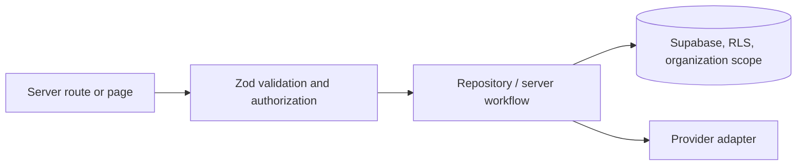

# Codex Playbook

**Status:** Current engineering handbook. It translates the [Vision](../00-overview/vision.md), [North Star](../00-overview/north-star.md), and [Design Principles](../01-design-system/design-principles.md) into delivery rules.

## Before writing code

1. Read the relevant Blueprint pages, PRD, ADRs, migrations, and existing implementation.
2. Confirm what is **Current**, **Planned**, or **Future Vision**; do not build from an implied promise.
3. Reuse existing components and domain helpers. Avoid duplicate business logic.
4. Prefer composition over duplication and small focused components over oversized route files.
5. Default to Server Components. Add client components only for necessary interaction.
6. Define loading, empty, error, responsive, authorization, and tenant behavior before implementation.

## Architecture and repository pattern

| Area | Rule |
| --- | --- |
| Server Components | Keep read-heavy pages server-rendered; pass only serializable, customer-safe props to clients |
| Client Components | Use only for interactive state; keep privileged access and secrets out of the browser |
| Repository | `lib/server/repository.ts` owns persistence/workflow coordination, not UI rendering |
| Authorization | Enforce it server-side; hidden UI is never a permission check |
| Tenant data | Scope organization-owned queries by `organization_id` and preserve RLS |
| Integrations | Persist durable local state, use idempotency, and isolate provider failure from business success |

## Naming and folder structure

- Use explicit domain names (`appointment-reminders`, `communications`, `organization`) rather than generic utilities.
- Follow existing App Router boundaries: `app/` routes, `components/` reusable UI, `lib/` domain logic, `lib/server/` privileged workflows, `supabase/migrations/` append-only schema changes, and `tests/` by test level.
- Use `@/` imports and established component names before introducing alternatives.

## Database migrations

1. Inspect deployed migrations, current schema, affected repository methods, and tenant impact.
2. Create a new append-only migration; never rewrite an applied migration.
3. Include defaults/backfills, indexes, foreign keys, nullability, delete behavior, organization scope, and RLS changes.
4. Document recovery or rollout risk for destructive, enum, or provider-sensitive changes.
5. Validate in staging before production. Never use destructive production data operations without explicit approval.

## Testing, accessibility, and documentation

| Concern | Required practice |
| --- | --- |
| Tests | Add focused unit tests for logic; run integration/E2E tests when repository, RLS, auth, browser flow, or responsive behavior changes |
| Accessibility | Check semantic structure, focus, keyboard behavior, contrast, labels, and loading/empty/error states |
| Documentation | Update Blueprint, PRD, ADR, release notes, and technical debt when the change affects their scope |
| Performance | Avoid broad data loading, unnecessary hydration, fake metrics, and unstable layout |

## Git workflow

| Practice | Standard |
| --- | --- |
| Branch naming | `feature/`, `fix/`, `docs/`, or `chore/` plus concise kebab-case scope |
| Scope | One coherent change per branch and PR; avoid opportunistic refactors |
| Commits | Descriptive, imperative, and free of generated files or secrets |
| Pull requests | Explain behavior, risk, migration impact, tests, and remaining limitations |
| Main | Do not force-push or bypass review for substantive work |

## Before opening a pull request

- [ ] `pnpm typecheck`, `pnpm lint`, `pnpm test`, and `pnpm build` pass.
- [ ] Relevant integration and E2E commands pass or the limitation is disclosed.
- [ ] Accessibility, loading, empty, error, and responsive behavior are reviewed.
- [ ] Documentation is updated; no unused code or unresolved TODO comments remain.
- [ ] Tenant isolation, authorization, migration safety, and provider failure paths are reviewed.

## Never do

- Duplicate business logic or create a second persistence path for the same workflow.
- Hardcode production data, credentials, provider tokens, prices, or delivery success.
- Invent system-health values, operational metrics, or customer-facing completion claims.
- Treat hidden controls as authorization, weaken RLS, or expose privileged clients to the browser.
- Skip mobile behavior, accessibility, tests, documentation, or failure states to save time.
- Commit secrets, generated output, or unrelated formatting changes.

## Definition of Done

A change is done when it satisfies its product intent, preserves safety and tenant isolation, passes proportionate validation, documents meaningful decisions, and states remaining limitations plainly. See the detailed [Definition of Done](../engineering/definition-of-done.md) and [development workflow](../engineering/development-workflow.md).
